# IdeaCode Website Data Flow Architecture

## 1. Overview

This document details the data flow architecture for the IdeaCode website, illustrating how different types of data move through the system. The architecture is designed to support the core messaging framework (enterprise-grade orchestration layer) and the key differentiators (Model Portability, Orchestration Excellence, Memory Persistence, Operational Reliability).

## 2. High-Level Data Flow Diagram

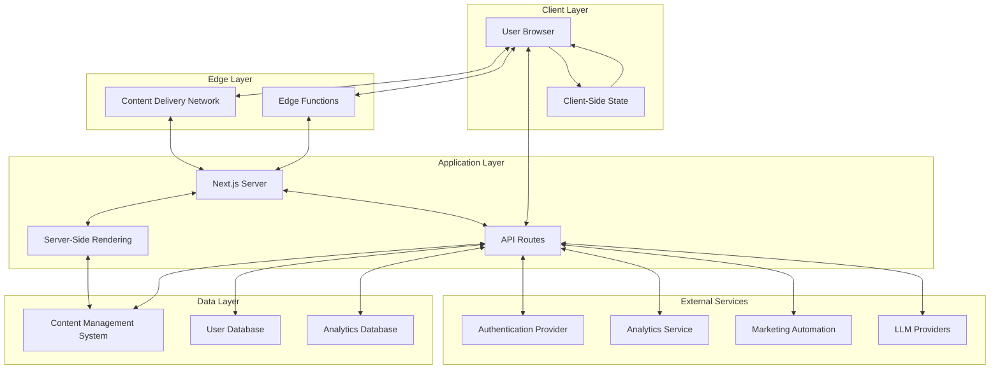
```mermaid
graph TD
    subgraph "Client Layer"
        Browser[User Browser]
        ClientState[Client-Side State]
    end
    
    subgraph "Edge Layer"
        CDN[Content Delivery Network]
        EdgeFunctions[Edge Functions]
    end
    
    subgraph "Application Layer"
        NextJS[Next.js Server]
        SSR[Server-Side Rendering]
        APIRoutes[API Routes]
    end
    
    subgraph "Data Layer"
        CMS[Content Management System]
        UserDB[User Database]
        AnalyticsDB[Analytics Database]
    end
    
    subgraph "External Services"
        AuthProvider[Authentication Provider]
        AnalyticsService[Analytics Service]
        MarketingTools[Marketing Automation]
        LLMProviders[LLM Providers]
    end
    
    Browser <--> CDN
    Browser <--> EdgeFunctions
    Browser <--> APIRoutes
    
    CDN <--> NextJS
    EdgeFunctions <--> NextJS
    
    NextJS <--> SSR
    NextJS <--> APIRoutes
    
    SSR <--> CMS
    APIRoutes <--> CMS
    APIRoutes <--> UserDB
    APIRoutes <--> AnalyticsDB
    
    APIRoutes <--> AuthProvider
    APIRoutes <--> AnalyticsService
    APIRoutes <--> MarketingTools
    APIRoutes <--> LLMProviders
    
    Browser --> ClientState
    ClientState --> Browser
```

## 3. Content Data Flow

### 3.1 Content Creation and Publishing Flow

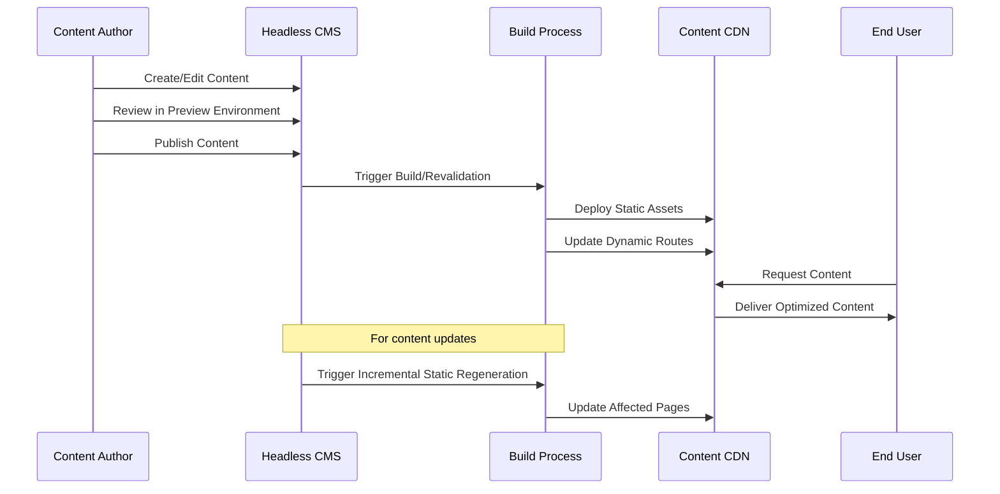
```mermaid
sequenceDiagram
    participant Author as Content Author
    participant CMS as Headless CMS
    participant Build as Build Process
    participant CDN as Content CDN
    participant User as End User
    
    Author->>CMS: Create/Edit Content
    Author->>CMS: Review in Preview Environment
    Author->>CMS: Publish Content
    
    CMS->>Build: Trigger Build/Revalidation
    Build->>CDN: Deploy Static Assets
    Build->>CDN: Update Dynamic Routes
    
    User->>CDN: Request Content
    CDN->>User: Deliver Optimized Content
    
    Note over CMS,Build: For content updates
    CMS->>Build: Trigger Incremental Static Regeneration
    Build->>CDN: Update Affected Pages
```

### 3.2 Content Retrieval Flow

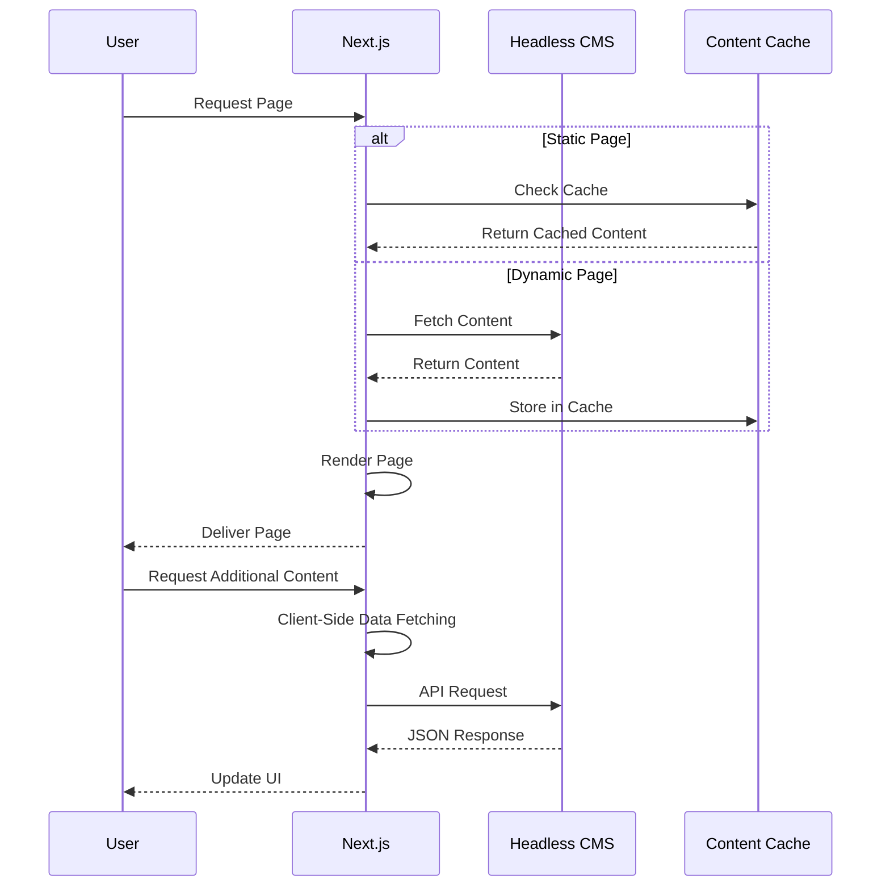
```mermaid
sequenceDiagram
    participant User as User
    participant Next as Next.js
    participant CMS as Headless CMS
    participant Cache as Content Cache
    
    User->>Next: Request Page
    
    alt Static Page
        Next->>Cache: Check Cache
        Cache-->>Next: Return Cached Content
    else Dynamic Page
        Next->>CMS: Fetch Content
        CMS-->>Next: Return Content
        Next->>Cache: Store in Cache
    end
    
    Next->>Next: Render Page
    Next-->>User: Deliver Page
    
    User->>Next: Request Additional Content
    Next->>Next: Client-Side Data Fetching
    Next->>CMS: API Request
    CMS-->>Next: JSON Response
    Next-->>User: Update UI
```

### 3.3 Content Personalization Flow

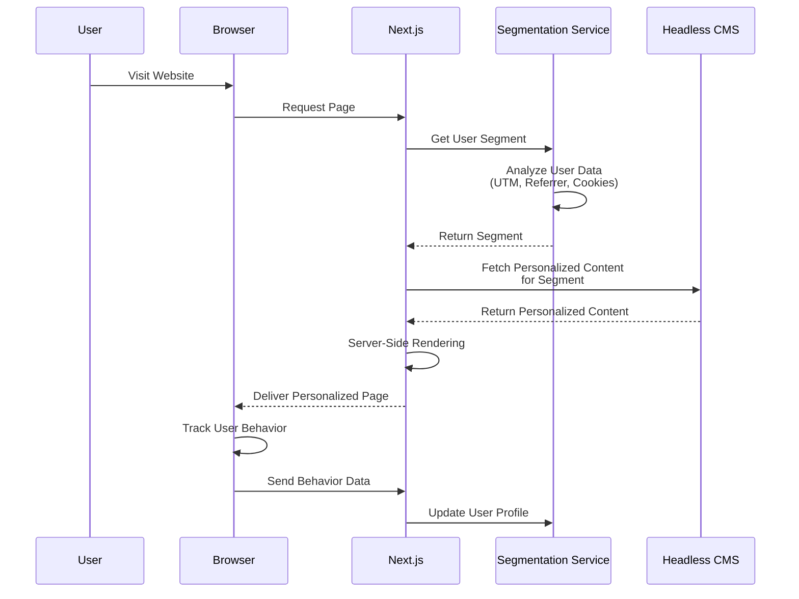
```mermaid
sequenceDiagram
    participant User as User
    participant Browser as Browser
    participant Next as Next.js
    participant Segment as Segmentation Service
    participant CMS as Headless CMS
    
    User->>Browser: Visit Website
    Browser->>Next: Request Page
    
    Next->>Segment: Get User Segment
    Segment->>Segment: Analyze User Data<br>(UTM, Referrer, Cookies)
    Segment-->>Next: Return Segment
    
    Next->>CMS: Fetch Personalized Content<br>for Segment
    CMS-->>Next: Return Personalized Content
    
    Next->>Next: Server-Side Rendering
    Next-->>Browser: Deliver Personalized Page
    
    Browser->>Browser: Track User Behavior
    Browser->>Next: Send Behavior Data
    Next->>Segment: Update User Profile
```

## 4. User Data Flow

### 4.1 Authentication Flow

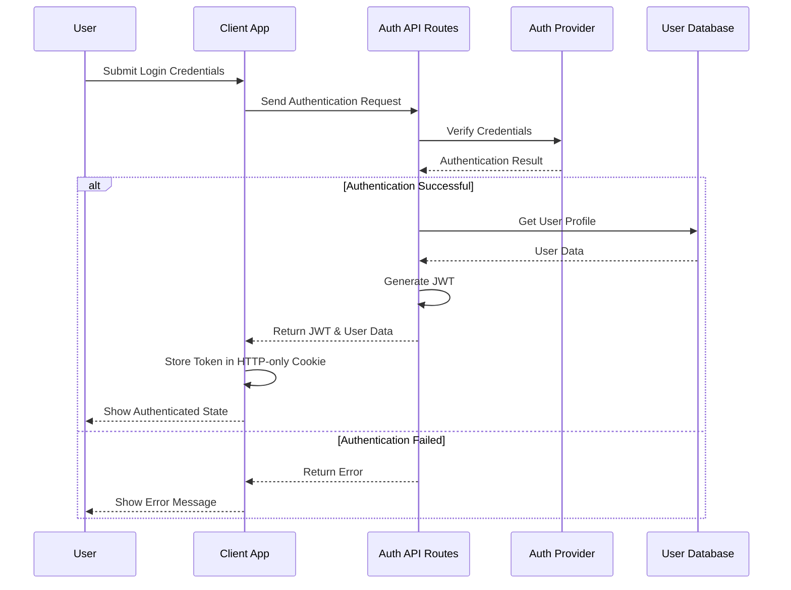
```mermaid
sequenceDiagram
    participant User as User
    participant Client as Client App
    participant Auth as Auth API Routes
    participant Provider as Auth Provider
    participant DB as User Database
    
    User->>Client: Submit Login Credentials
    Client->>Auth: Send Authentication Request
    Auth->>Provider: Verify Credentials
    Provider-->>Auth: Authentication Result
    
    alt Authentication Successful
        Auth->>DB: Get User Profile
        DB-->>Auth: User Data
        Auth->>Auth: Generate JWT
        Auth-->>Client: Return JWT & User Data
        Client->>Client: Store Token in HTTP-only Cookie
        Client-->>User: Show Authenticated State
    else Authentication Failed
        Auth-->>Client: Return Error
        Client-->>User: Show Error Message
    end
```

### 4.2 User Journey Tracking Flow

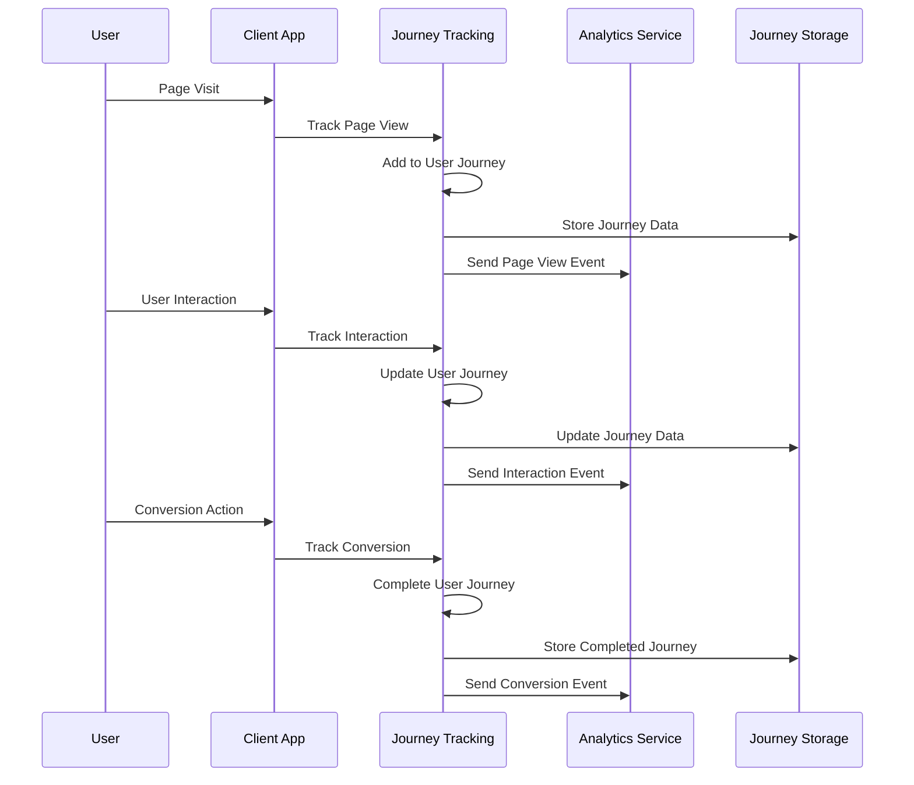
```mermaid
sequenceDiagram
    participant User as User
    participant Client as Client App
    participant Journey as Journey Tracking
    participant Analytics as Analytics Service
    participant Storage as Journey Storage
    
    User->>Client: Page Visit
    Client->>Journey: Track Page View
    Journey->>Journey: Add to User Journey
    Journey->>Storage: Store Journey Data
    Journey->>Analytics: Send Page View Event
    
    User->>Client: User Interaction
    Client->>Journey: Track Interaction
    Journey->>Journey: Update User Journey
    Journey->>Storage: Update Journey Data
    Journey->>Analytics: Send Interaction Event
    
    User->>Client: Conversion Action
    Client->>Journey: Track Conversion
    Journey->>Journey: Complete User Journey
    Journey->>Storage: Store Completed Journey
    Journey->>Analytics: Send Conversion Event
```

### 4.3 User Preference Flow

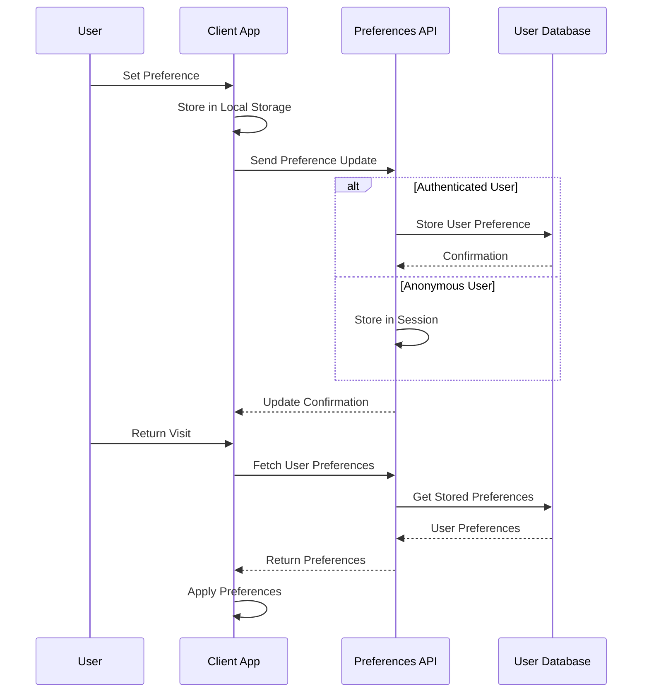
```mermaid
sequenceDiagram
    participant User as User
    participant Client as Client App
    participant API as Preferences API
    participant DB as User Database
    
    User->>Client: Set Preference
    Client->>Client: Store in Local Storage
    Client->>API: Send Preference Update
    
    alt Authenticated User
        API->>DB: Store User Preference
        DB-->>API: Confirmation
    else Anonymous User
        API->>API: Store in Session
    end
    
    API-->>Client: Update Confirmation
    
    User->>Client: Return Visit
    Client->>API: Fetch User Preferences
    API->>DB: Get Stored Preferences
    DB-->>API: User Preferences
    API-->>Client: Return Preferences
    Client->>Client: Apply Preferences
```

## 5. Analytics Data Flow

### 5.1 Event Tracking Flow

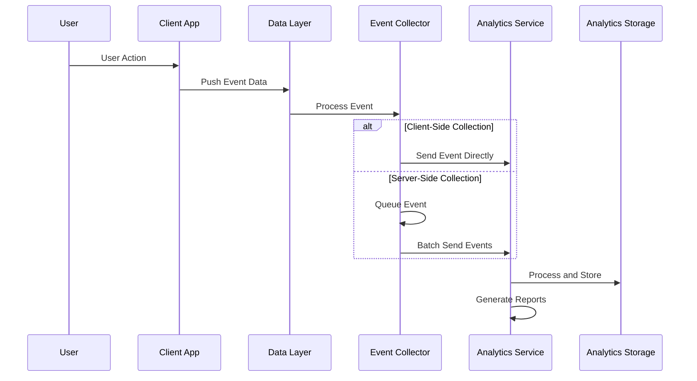
```mermaid
sequenceDiagram
    participant User as User
    participant Client as Client App
    participant DataLayer as Data Layer
    participant Collector as Event Collector
    participant Analytics as Analytics Service
    participant Storage as Analytics Storage
    
    User->>Client: User Action
    Client->>DataLayer: Push Event Data
    DataLayer->>Collector: Process Event
    
    alt Client-Side Collection
        Collector->>Analytics: Send Event Directly
    else Server-Side Collection
        Collector->>Collector: Queue Event
        Collector->>Analytics: Batch Send Events
    end
    
    Analytics->>Storage: Process and Store
    Analytics->>Analytics: Generate Reports
```

### 5.2 Performance Monitoring Flow

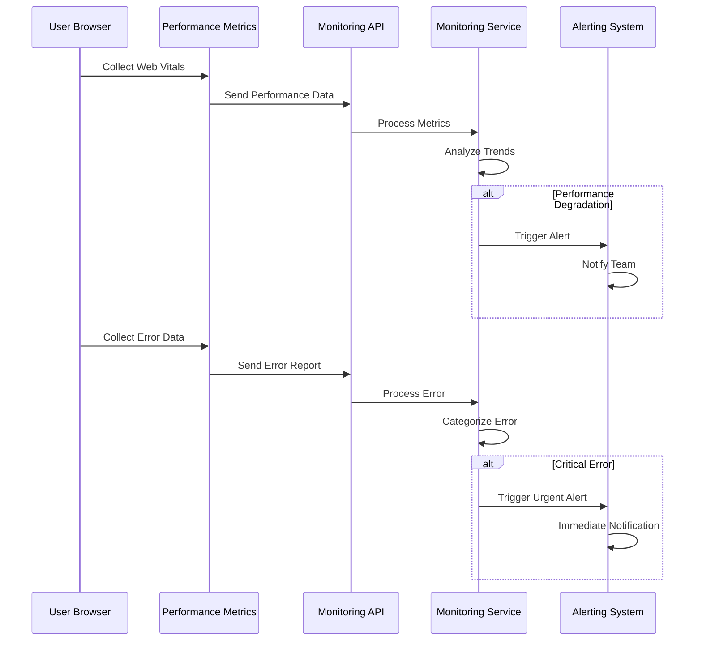
```mermaid
sequenceDiagram
    participant User as User Browser
    participant Metrics as Performance Metrics
    participant API as Monitoring API
    participant Service as Monitoring Service
    participant Alerts as Alerting System
    
    User->>Metrics: Collect Web Vitals
    Metrics->>API: Send Performance Data
    API->>Service: Process Metrics
    Service->>Service: Analyze Trends
    
    alt Performance Degradation
        Service->>Alerts: Trigger Alert
        Alerts->>Alerts: Notify Team
    end
    
    User->>Metrics: Collect Error Data
    Metrics->>API: Send Error Report
    API->>Service: Process Error
    Service->>Service: Categorize Error
    
    alt Critical Error
        Service->>Alerts: Trigger Urgent Alert
        Alerts->>Alerts: Immediate Notification
    end
```

### 5.3 A/B Testing Flow

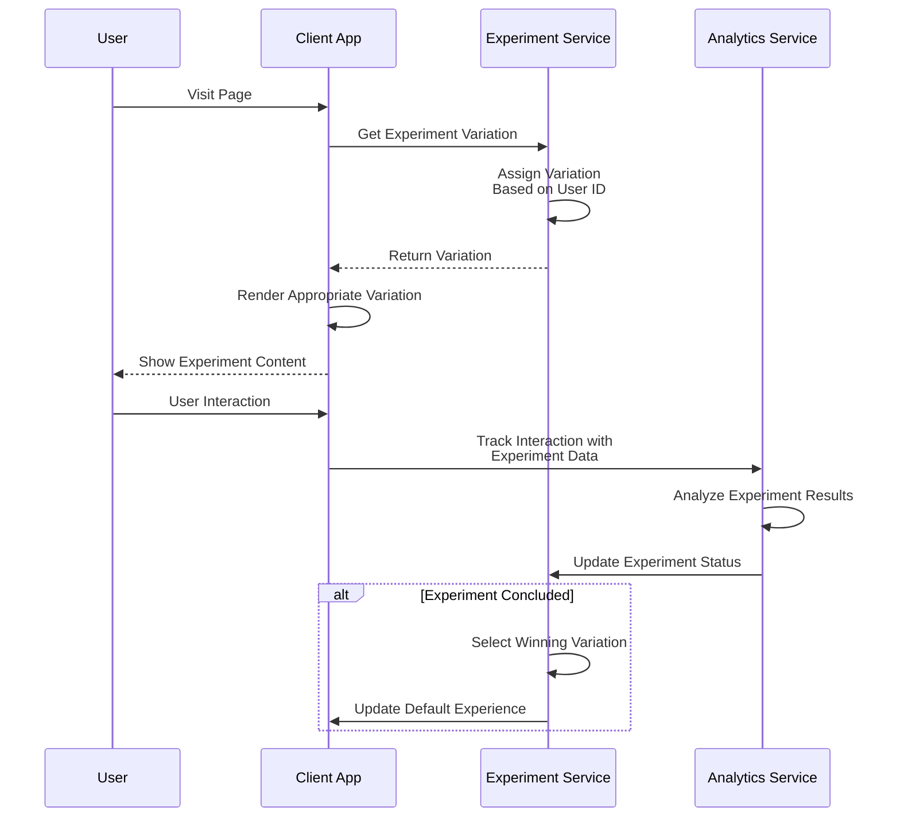
```mermaid
sequenceDiagram
    participant User as User
    participant Client as Client App
    participant Experiment as Experiment Service
    participant Analytics as Analytics Service
    
    User->>Client: Visit Page
    Client->>Experiment: Get Experiment Variation
    Experiment->>Experiment: Assign Variation<br>Based on User ID
    Experiment-->>Client: Return Variation
    
    Client->>Client: Render Appropriate Variation
    Client-->>User: Show Experiment Content
    
    User->>Client: User Interaction
    Client->>Analytics: Track Interaction with<br>Experiment Data
    
    Analytics->>Analytics: Analyze Experiment Results
    Analytics->>Experiment: Update Experiment Status
    
    alt Experiment Concluded
        Experiment->>Experiment: Select Winning Variation
        Experiment->>Client: Update Default Experience
    end
```

## 6. Integration Data Flows

### 6.1 LLM Provider Integration Flow

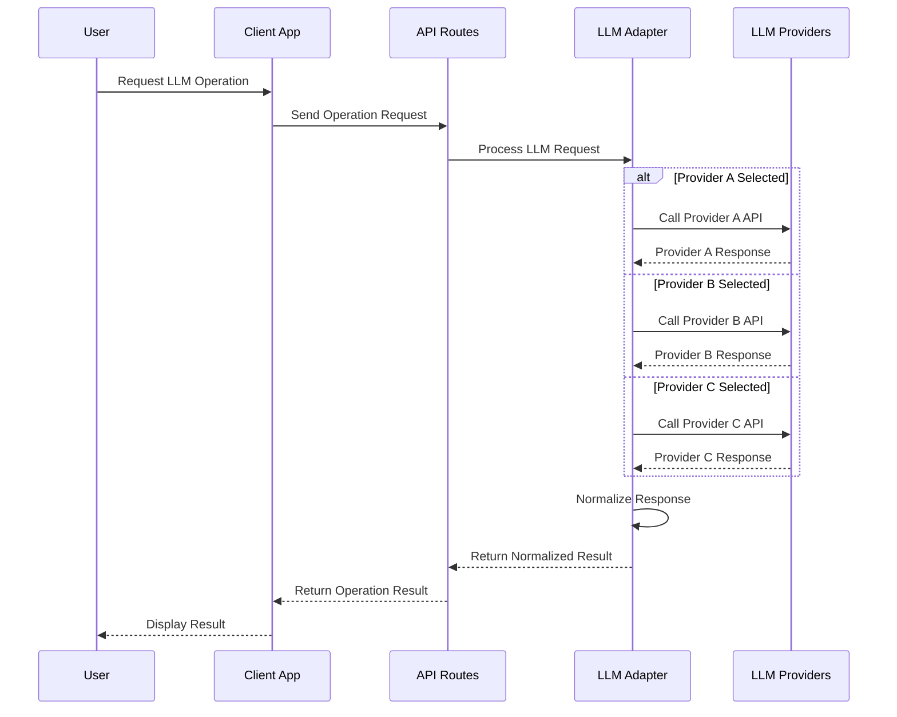
```mermaid
sequenceDiagram
    participant User as User
    participant Client as Client App
    participant API as API Routes
    participant Adapter as LLM Adapter
    participant Providers as LLM Providers
    
    User->>Client: Request LLM Operation
    Client->>API: Send Operation Request
    
    API->>Adapter: Process LLM Request
    
    alt Provider A Selected
        Adapter->>Providers: Call Provider A API
        Providers-->>Adapter: Provider A Response
    else Provider B Selected
        Adapter->>Providers: Call Provider B API
        Providers-->>Adapter: Provider B Response
    else Provider C Selected
        Adapter->>Providers: Call Provider C API
        Providers-->>Adapter: Provider C Response
    end
    
    Adapter->>Adapter: Normalize Response
    Adapter-->>API: Return Normalized Result
    API-->>Client: Return Operation Result
    Client-->>User: Display Result
```

### 6.2 Marketing Automation Flow

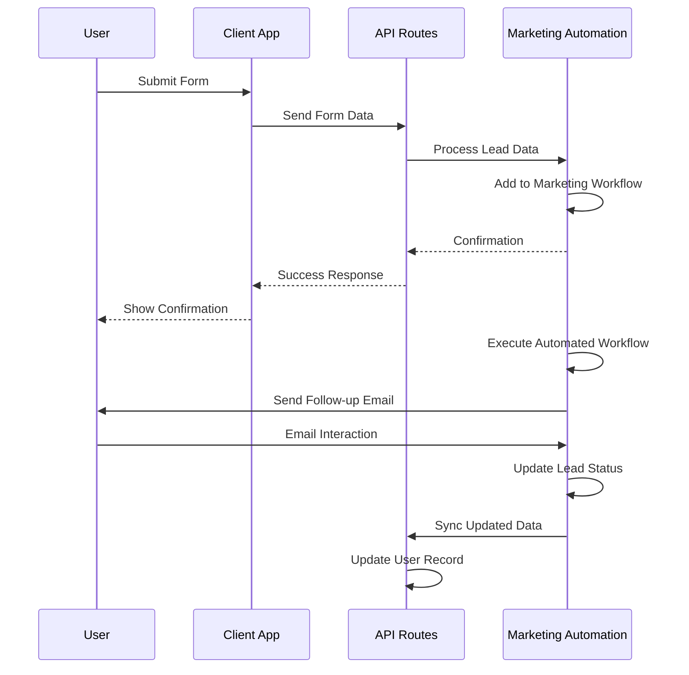
```mermaid
sequenceDiagram
    participant User as User
    participant Client as Client App
    participant API as API Routes
    participant Marketing as Marketing Automation
    
    User->>Client: Submit Form
    Client->>API: Send Form Data
    API->>Marketing: Process Lead Data
    
    Marketing->>Marketing: Add to Marketing Workflow
    Marketing-->>API: Confirmation
    API-->>Client: Success Response
    Client-->>User: Show Confirmation
    
    Marketing->>Marketing: Execute Automated Workflow
    Marketing->>User: Send Follow-up Email
    
    User->>Marketing: Email Interaction
    Marketing->>Marketing: Update Lead Status
    Marketing->>API: Sync Updated Data
    API->>API: Update User Record
```

### 6.3 Documentation System Flow

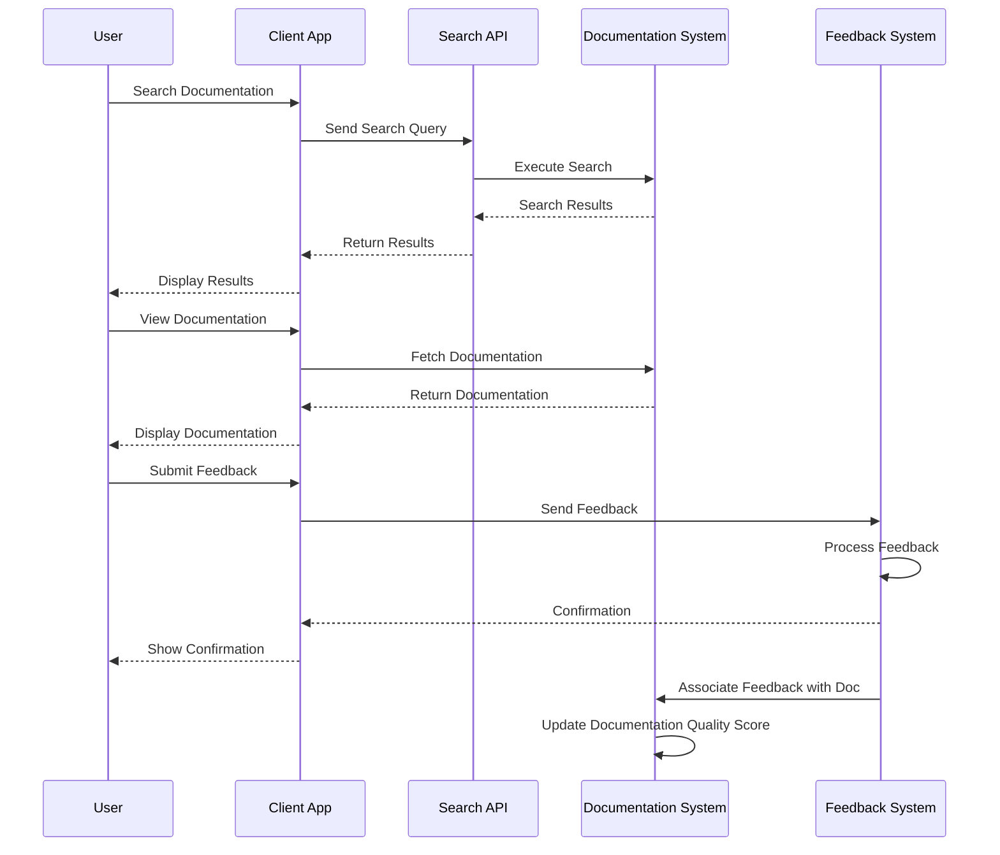
```mermaid
sequenceDiagram
    participant User as User
    participant Client as Client App
    participant Search as Search API
    participant Docs as Documentation System
    participant Feedback as Feedback System
    
    User->>Client: Search Documentation
    Client->>Search: Send Search Query
    Search->>Docs: Execute Search
    Docs-->>Search: Search Results
    Search-->>Client: Return Results
    Client-->>User: Display Results
    
    User->>Client: View Documentation
    Client->>Docs: Fetch Documentation
    Docs-->>Client: Return Documentation
    Client-->>User: Display Documentation
    
    User->>Client: Submit Feedback
    Client->>Feedback: Send Feedback
    Feedback->>Feedback: Process Feedback
    Feedback-->>Client: Confirmation
    Client-->>User: Show Confirmation
    
    Feedback->>Docs: Associate Feedback with Doc
    Docs->>Docs: Update Documentation Quality Score
```

## 7. Content Delivery Optimization

### 7.1 Static Asset Delivery Flow

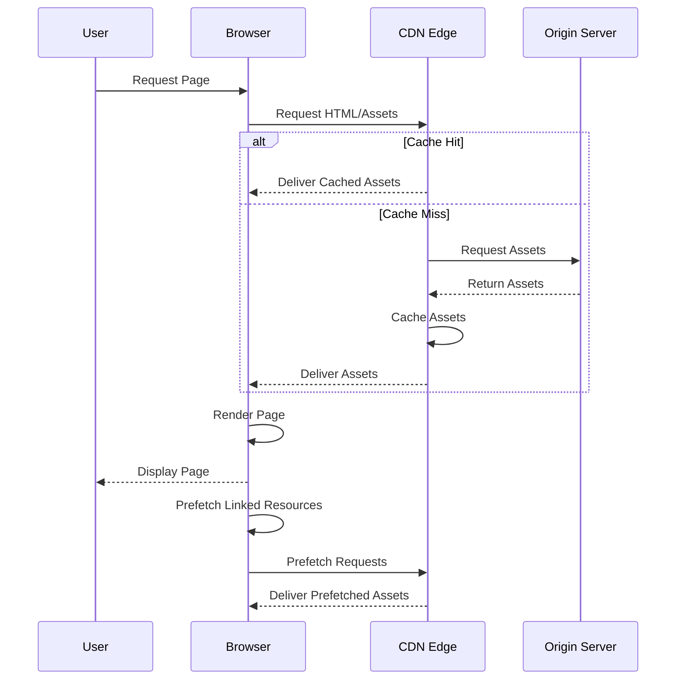
```mermaid
sequenceDiagram
    participant User as User
    participant Browser as Browser
    participant CDN as CDN Edge
    participant Origin as Origin Server
    
    User->>Browser: Request Page
    Browser->>CDN: Request HTML/Assets
    
    alt Cache Hit
        CDN-->>Browser: Deliver Cached Assets
    else Cache Miss
        CDN->>Origin: Request Assets
        Origin-->>CDN: Return Assets
        CDN->>CDN: Cache Assets
        CDN-->>Browser: Deliver Assets
    end
    
    Browser->>Browser: Render Page
    Browser-->>User: Display Page
    
    Browser->>Browser: Prefetch Linked Resources
    Browser->>CDN: Prefetch Requests
    CDN-->>Browser: Deliver Prefetched Assets
```

### 7.2 Image Optimization Flow

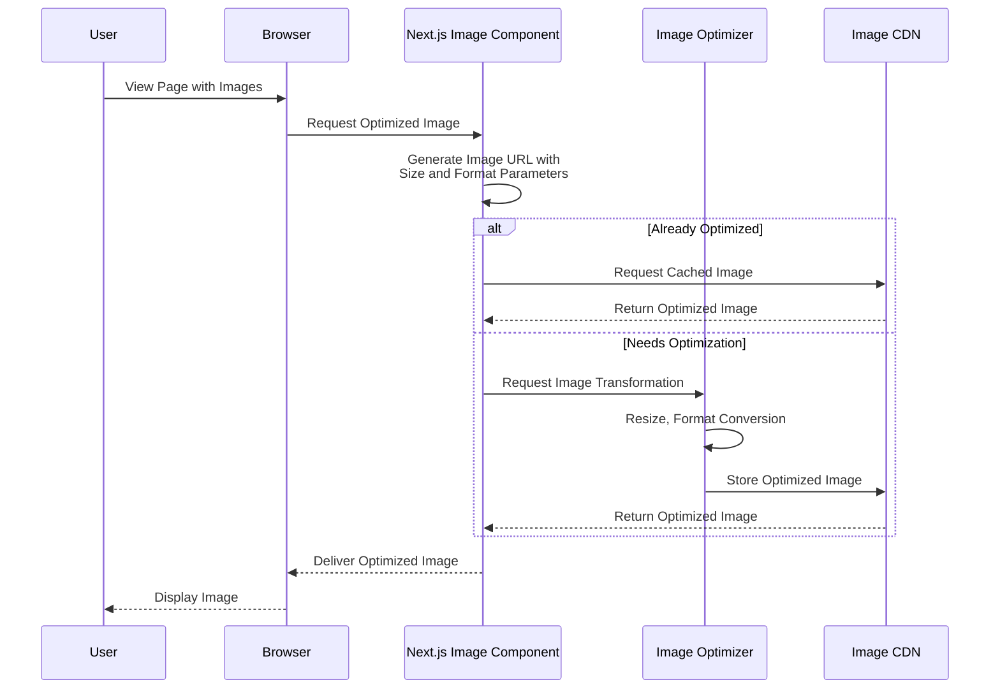
```mermaid
sequenceDiagram
    participant User as User
    participant Browser as Browser
    participant Next as Next.js Image Component
    participant Optimizer as Image Optimizer
    participant CDN as Image CDN
    
    User->>Browser: View Page with Images
    Browser->>Next: Request Optimized Image
    
    Next->>Next: Generate Image URL with<br>Size and Format Parameters
    
    alt Already Optimized
        Next->>CDN: Request Cached Image
        CDN-->>Next: Return Optimized Image
    else Needs Optimization
        Next->>Optimizer: Request Image Transformation
        Optimizer->>Optimizer: Resize, Format Conversion
        Optimizer->>CDN: Store Optimized Image
        CDN-->>Next: Return Optimized Image
    end
    
    Next-->>Browser: Deliver Optimized Image
    Browser-->>User: Display Image
```

### 7.3 Code Delivery Optimization Flow

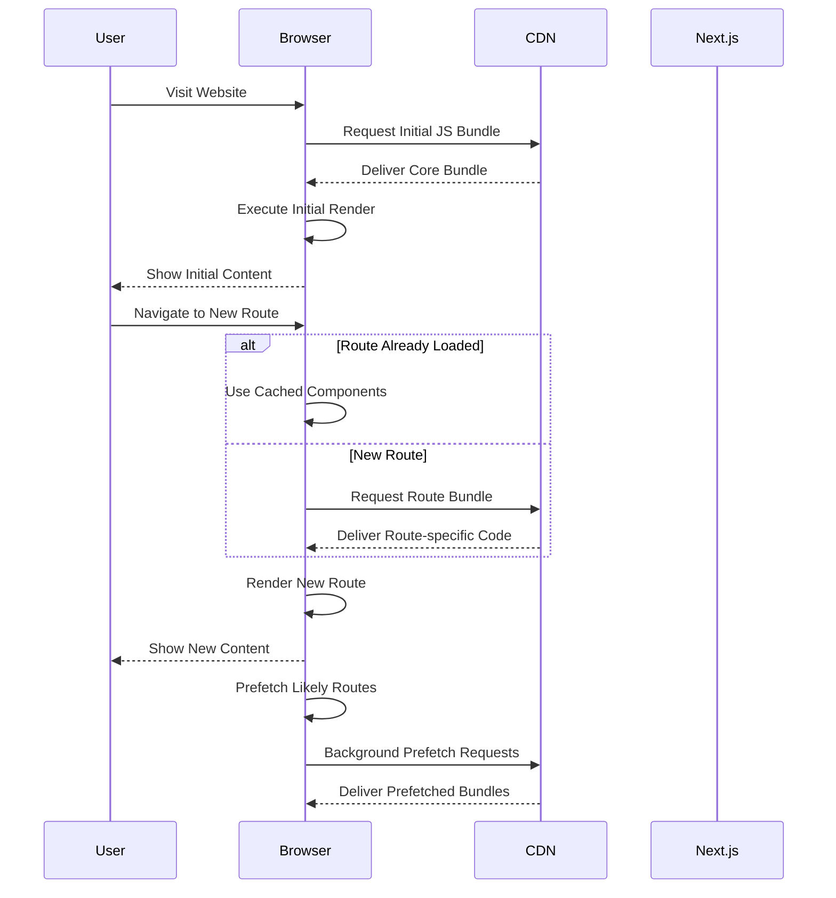
```mermaid
sequenceDiagram
    participant User as User
    participant Browser as Browser
    participant CDN as CDN
    participant Next as Next.js
    
    User->>Browser: Visit Website
    Browser->>CDN: Request Initial JS Bundle
    CDN-->>Browser: Deliver Core Bundle
    
    Browser->>Browser: Execute Initial Render
    Browser-->>User: Show Initial Content
    
    User->>Browser: Navigate to New Route
    
    alt Route Already Loaded
        Browser->>Browser: Use Cached Components
    else New Route
        Browser->>CDN: Request Route Bundle
        CDN-->>Browser: Deliver Route-specific Code
    end
    
    Browser->>Browser: Render New Route
    Browser-->>User: Show New Content
    
    Browser->>Browser: Prefetch Likely Routes
    Browser->>CDN: Background Prefetch Requests
    CDN-->>Browser: Deliver Prefetched Bundles
```

## 8. Data Security and Privacy Flow

### 8.1 Data Protection Flow

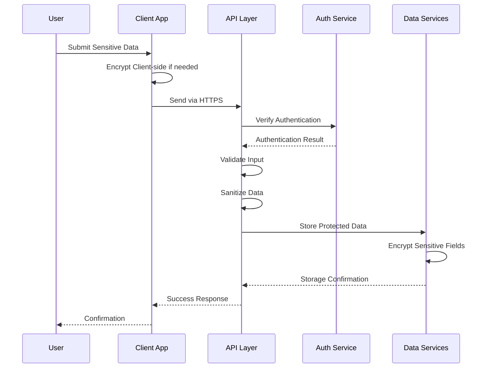
```mermaid
sequenceDiagram
    participant User as User
    participant Client as Client App
    participant API as API Layer
    participant Auth as Auth Service
    participant Data as Data Services
    
    User->>Client: Submit Sensitive Data
    Client->>Client: Encrypt Client-side if needed
    Client->>API: Send via HTTPS
    
    API->>Auth: Verify Authentication
    Auth-->>API: Authentication Result
    
    API->>API: Validate Input
    API->>API: Sanitize Data
    
    API->>Data: Store Protected Data
    Data->>Data: Encrypt Sensitive Fields
    Data-->>API: Storage Confirmation
    
    API-->>Client: Success Response
    Client-->>User: Confirmation
```

### 8.2 Consent Management Flow

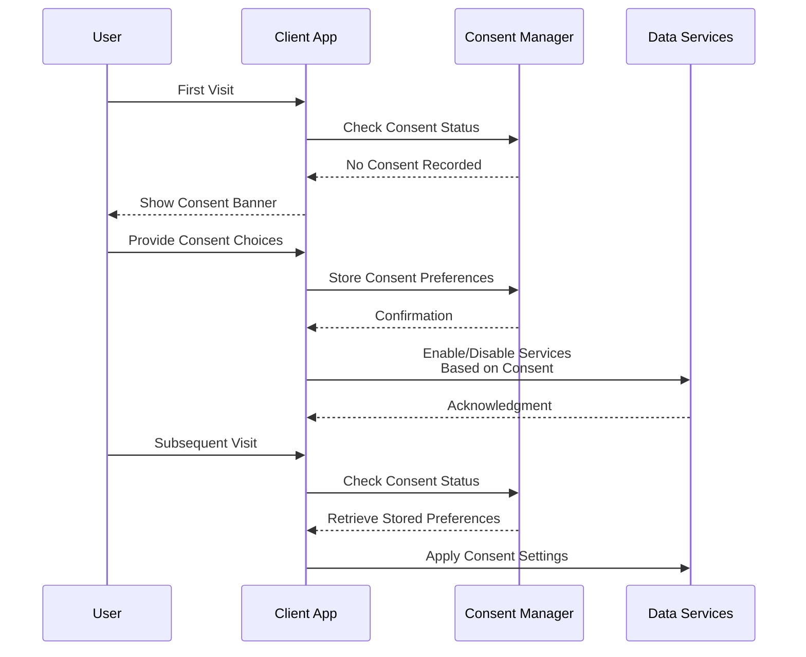
```mermaid
sequenceDiagram
    participant User as User
    participant Client as Client App
    participant Consent as Consent Manager
    participant Services as Data Services
    
    User->>Client: First Visit
    Client->>Consent: Check Consent Status
    Consent-->>Client: No Consent Recorded
    Client-->>User: Show Consent Banner
    
    User->>Client: Provide Consent Choices
    Client->>Consent: Store Consent Preferences
    Consent-->>Client: Confirmation
    
    Client->>Services: Enable/Disable Services<br>Based on Consent
    Services-->>Client: Acknowledgment
    
    User->>Client: Subsequent Visit
    Client->>Consent: Check Consent Status
    Consent-->>Client: Retrieve Stored Preferences
    Client->>Services: Apply Consent Settings
```

### 8.3 Access Control Flow

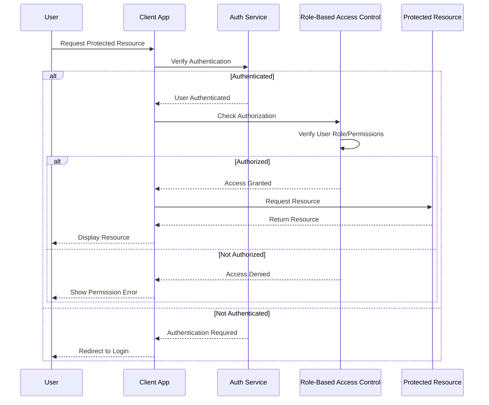
```mermaid
sequenceDiagram
    participant User as User
    participant Client as Client App
    participant Auth as Auth Service
    participant RBAC as Role-Based Access Control
    participant Resource as Protected Resource
    
    User->>Client: Request Protected Resource
    Client->>Auth: Verify Authentication
    
    alt Authenticated
        Auth-->>Client: User Authenticated
        Client->>RBAC: Check Authorization
        RBAC->>RBAC: Verify User Role/Permissions
        
        alt Authorized
            RBAC-->>Client: Access Granted
            Client->>Resource: Request Resource
            Resource-->>Client: Return Resource
            Client-->>User: Display Resource
        else Not Authorized
            RBAC-->>Client: Access Denied
            Client-->>User: Show Permission Error
        end
    else Not Authenticated
        Auth-->>Client: Authentication Required
        Client-->>User: Redirect to Login
    end
```

## 9. Data Synchronization Patterns

### 9.1 Optimistic Updates Flow

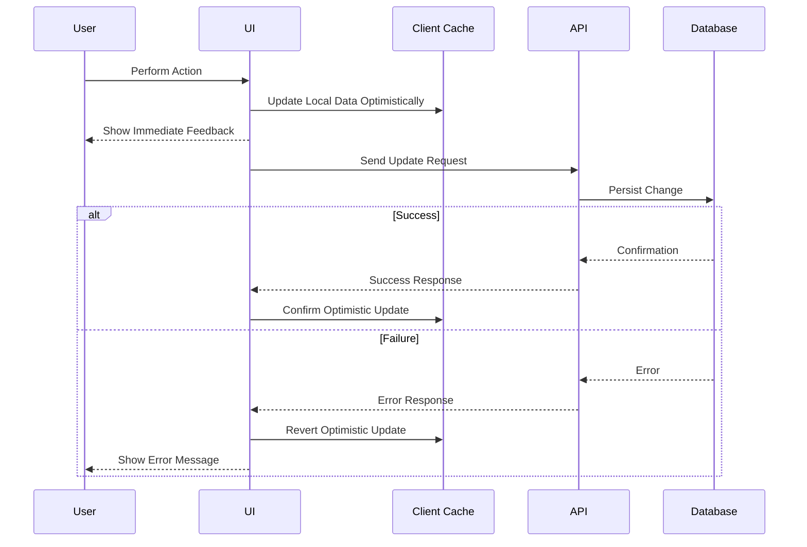
```mermaid
sequenceDiagram
    participant User as User
    participant UI as UI
    participant Cache as Client Cache
    participant API as API
    participant DB as Database
    
    User->>UI: Perform Action
    UI->>Cache: Update Local Data Optimistically
    UI-->>User: Show Immediate Feedback
    
    UI->>API: Send Update Request
    API->>DB: Persist Change
    
    alt Success
        DB-->>API: Confirmation
        API-->>UI: Success Response
        UI->>Cache: Confirm Optimistic Update
    else Failure
        DB-->>API: Error
        API-->>UI: Error Response
        UI->>Cache: Revert Optimistic Update
        UI-->>User: Show Error Message
    end
```

### 9.2 Real-time Updates Flow

```mermaid
sequenceDiagram
    participant User1 as User 1
    participant Client1 as Client 1
    participant API as API
    participant DB as Database
    participant Client2 as Client 2
    participant User2 as User 2
    
    User1->>Client1: Make Change
    Client1->>API: Send Update
    API->>DB: Persist Change
    DB-->>API: Confirmation
    
    API->>API: Publish Update Event
    
    par Notify Client 1
        API-->>Client1: Update Confirmation
        Client1-->>User1: Show Success
    and Notify Client 2
        API-->>Client2: Push Update Notification
        Client2->>Client2: Update Local State
        Client2-->>User2: Reflect Changes
    end
```

### 9.3 Offline Support Flow

```mermaid
sequenceDiagram
    participant User as User
    participant Client as Client App
    participant SW as Service Worker
    participant Queue as Background Sync Queue
    participant API as API
    
    User->>Client: Perform Action Offline
    Client->>Client: Detect Offline State
    Client->>Queue: Queue Action
    Client-->>User: Show Pending Status
    
    Note over User,API: Later when connection is restored
    
    SW->>SW: Detect Online Status
    SW->>Queue: Process Queued Actions
    Queue->>API: Send Pending Requests
    API-->>Queue: Process Results
    
    Queue->>Client: Update Action Status
    Client-->>User: Show Final Status
```

## 10. Conclusion

This data flow architecture provides a comprehensive view of how different types of data move through the IdeaCode website system. By understanding these flows, developers can implement the system with clear boundaries and interfaces, ensuring that data is handled efficiently, securely, and in a way that supports the key differentiators of the platform.

The architecture emphasizes:

1. **Separation of Concerns**: Clear boundaries between different types of data and their handling
2. **Performance Optimization**: Strategic caching and delivery optimization for content and assets
3. **Security and Privacy**: Proper handling of sensitive data and user consent
4. **Scalability**: Patterns that support growth in users and content
5. **Resilience**: Handling offline scenarios and synchronization challenges

By following these data flow patterns, the implementation team can create a robust, performant website that effectively communicates IdeaCode's value proposition as an enterprise-grade orchestration layer for AI agent systems.