# IdeaCode Website Revamp: Comprehensive Architecture

## 1. System Architecture

### 1.1 Component Diagram

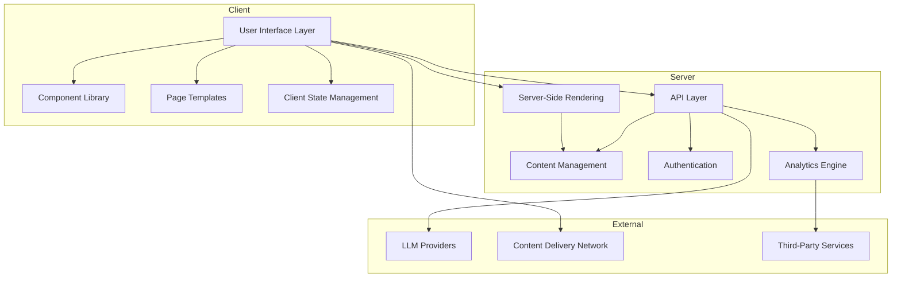

### 1.2 Interaction Patterns

#### 1.2.1 Client-Server Interaction

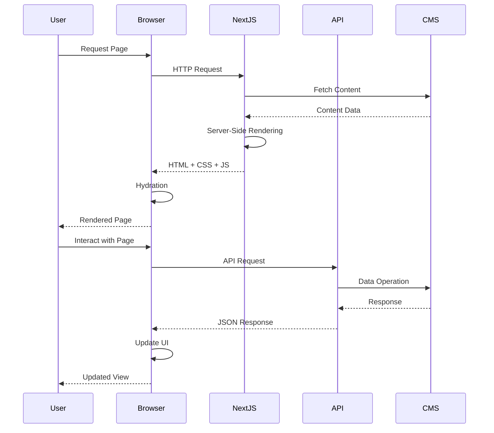

#### 1.2.2 User Segmentation and Personalization

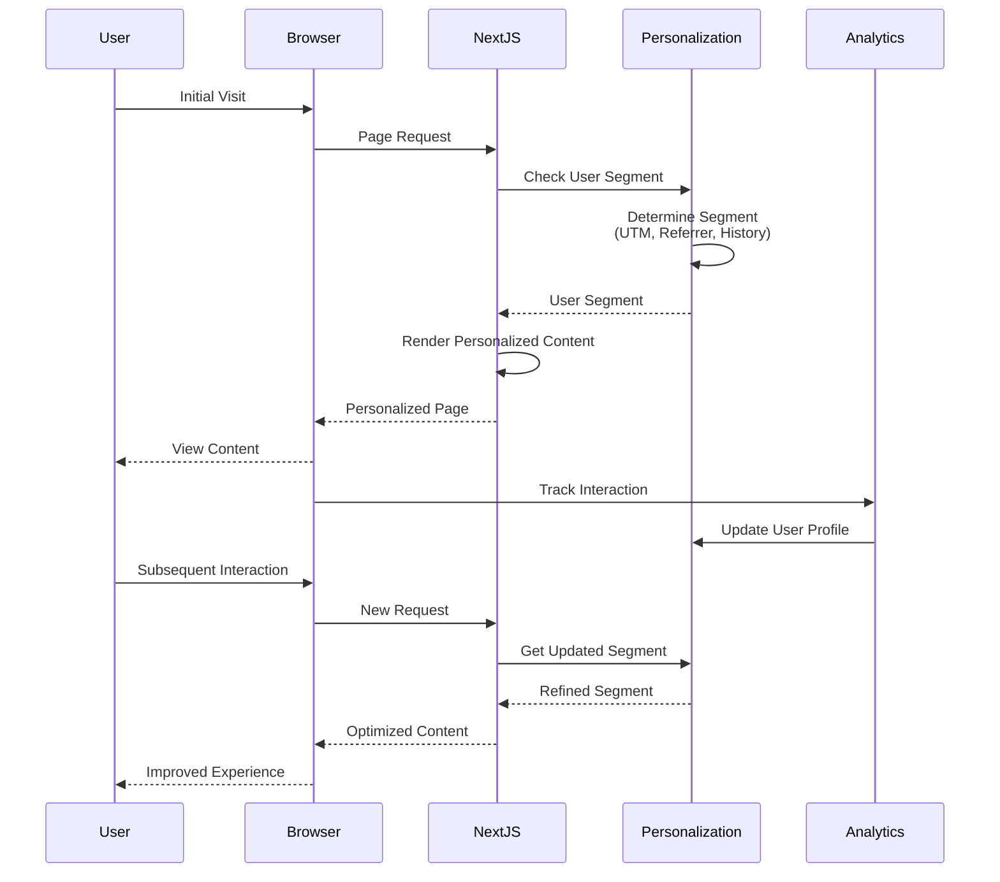

### 1.3 Data Flow Diagram

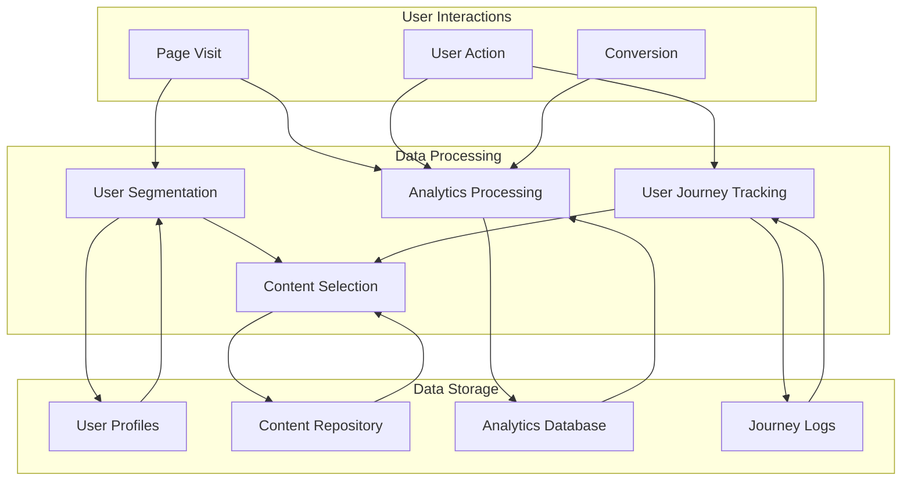

### 1.4 State Management Approach

The state management architecture follows a hybrid approach, combining server-side and client-side state management to optimize for performance and user experience:

#### Server State
- **Content State**: Managed through server-side rendering with Next.js
- **User Authentication State**: Handled via secure HTTP-only cookies
- **Shared Application State**: Critical application state maintained on the server

#### Client State
- **UI State**: Managed with React's Context API for component-level state
- **User Preferences**: Stored in browser localStorage/sessionStorage
- **Navigation State**: Managed by Next.js router
- **Form State**: Handled with React Hook Form for performance and validation

#### State Synchronization
- **Revalidation Strategy**: SWR (Stale-While-Revalidate) pattern for data fetching
- **Optimistic Updates**: Immediate UI updates with background synchronization
- **State Persistence**: Critical state persisted across sessions where appropriate

## 2. Technical Stack Definition

### 2.1 Next.js Implementation Approach

The website will be built using Next.js 14+ with the App Router architecture, leveraging:

- **Server Components**: For improved performance and reduced client-side JavaScript
- **Route Handlers**: For API endpoints and server-side operations
- **Static Site Generation (SSG)**: For content-heavy pages that don't require frequent updates
- **Incremental Static Regeneration (ISR)**: For pages that need periodic updates
- **Server-Side Rendering (SSR)**: For personalized or dynamic content
- **Edge Runtime**: For global performance optimization of critical paths

### 2.2 Frontend Framework Components and Libraries

#### Core Libraries
- **React 18+**: For component-based UI development
- **TypeScript**: For type safety and improved developer experience
- **Tailwind CSS**: For utility-first styling with custom design system integration
- **Framer Motion**: For high-performance animations and transitions

#### UI Component Libraries
- **Custom Component Library**: Built on Radix UI primitives for accessibility
- **Code Syntax Highlighting**: Using Prism or Shiki for technical documentation
- **Data Visualization**: D3.js for complex visualizations in technical documentation
- **Interactive Diagrams**: Mermaid.js for technical architecture visualization

#### State Management and Data Fetching
- **SWR/React Query**: For data fetching, caching, and state management
- **Zustand**: For lightweight global state management where needed
- **React Hook Form**: For form handling and validation

### 2.3 API Integration Points

```mermaid
graph LR
    subgraph Frontend
        Pages[Next.js Pages]
        Components[React Components]
    end
    
    subgraph API Layer
        REST[REST Endpoints]
        GraphQL[GraphQL API]
        Webhooks[Webhook Handlers]
    end
    
    subgraph External Services
        CMS[Headless CMS]
        Auth[Authentication Service]
        Analytics[Analytics Platform]
        LLM[LLM Providers]
    end
    
    Pages --> REST
    Pages --> GraphQL
    Components --> REST
    Components --> GraphQL
    
    REST --> CMS
    REST --> Auth
    REST --> Analytics
    REST --> LLM
    
    GraphQL --> CMS
    GraphQL --> Auth
    
    External Services --> Webhooks
```

#### API Architecture
- **REST API**: For standard CRUD operations and service integrations
- **GraphQL API**: For flexible content querying and aggregation
- **Webhook Handlers**: For event-driven integrations with external services

#### Integration Patterns
- **Adapter Pattern**: For LLM provider integrations, supporting the Model Portability differentiator
- **Facade Pattern**: For simplifying complex external service interactions
- **Repository Pattern**: For data access abstraction
- **Circuit Breaker Pattern**: For resilient external service communication

### 2.4 Content Management Strategy

The content management strategy employs a headless CMS approach with structured content modeling:

#### Content Structure
- **Content Types**: Modeled after the domain entities defined in the specifications
- **Content Relationships**: Maintained through reference fields and taxonomies
- **Content Versioning**: Support for content history and rollback
- **Content Localization**: Preparation for future internationalization

#### Content Delivery
- **Content API**: RESTful and GraphQL APIs for flexible content retrieval
- **Content CDN**: Edge-cached content delivery for global performance
- **Content Previews**: Staging environment for content review before publication

#### Content Authoring
- **Structured Editing**: Form-based editing for consistent content structure
- **Rich Text Editing**: Markdown-based editing with component embedding
- **Media Management**: Centralized digital asset management with optimization
- **Workflow**: Configurable approval workflows for content governance

## 3. Responsive Design Architecture

### 3.1 Breakpoint Strategy

The responsive design architecture follows a mobile-first approach with strategic breakpoints:

```
xs: 0px     - Mobile portrait
sm: 600px   - Mobile landscape/Small tablet
md: 960px   - Tablet/Small desktop
lg: 1280px  - Desktop
xl: 1920px  - Large desktop/TV
```

#### Implementation Approach
- **Container Queries**: For component-level responsiveness beyond viewport
- **Fluid Typography**: Using clamp() for smooth font scaling between breakpoints
- **Responsive Spacing**: Consistent spacing scale that adapts to viewport size
- **Aspect Ratio Preservation**: For media elements and interactive components

### 3.2 Component Adaptation Patterns

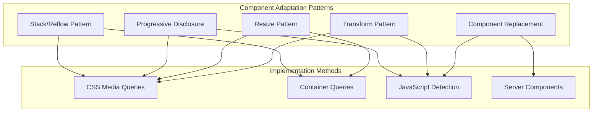

#### Adaptation Patterns
- **Stack/Reflow Pattern**: Reorganizing horizontal layouts to vertical for smaller screens
- **Progressive Disclosure**: Revealing content progressively as screen size increases
- **Resize Pattern**: Proportionally scaling components based on available space
- **Transform Pattern**: Changing component appearance while maintaining functionality
- **Component Replacement**: Substituting alternative components optimized for specific viewports

### 3.3 Mobile-First Considerations

The architecture prioritizes mobile experience through:

- **Performance Budgeting**: Strict limits on JavaScript, CSS, and media size for mobile
- **Touch Optimization**: Touch-friendly interaction targets (min 44×44px)
- **Offline Support**: Progressive Web App capabilities with service workers
- **Reduced Motion**: Respecting user preferences for reduced motion
- **Data Conservation**: Optimized asset loading and lazy loading for mobile networks
- **Viewport Optimization**: Preventing zoom issues and ensuring readable text sizes

## 4. Performance Optimization Architecture

### 4.1 Asset Loading Strategy

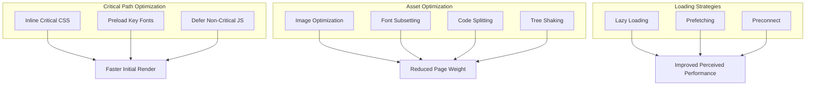

#### Implementation Details
- **Image Strategy**: Next.js Image component with automatic WebP/AVIF format selection
- **Font Strategy**: Variable fonts with preloading and font-display:swap
- **Script Loading**: Module/nomodule pattern with appropriate defer/async attributes
- **Resource Hints**: Strategic use of preload, prefetch, and preconnect directives

### 4.2 Caching Mechanisms

The caching strategy employs multiple layers for optimal performance:

#### Browser Caching
- **Static Assets**: Long-term caching with content-based hashing
- **API Responses**: Controlled caching with appropriate Cache-Control headers
- **HTML Documents**: Conditional caching based on content type and personalization

#### CDN Caching
- **Edge Caching**: Geographic distribution of static assets
- **Cache Invalidation**: Automated purging on content updates
- **Stale-While-Revalidate**: Serving stale content while updating in background

#### Application Caching
- **SWR Pattern**: For API responses and data fetching
- **Service Worker**: For offline access to critical resources
- **Memory Caching**: For frequently accessed application state

### 4.3 Code Splitting Approach

The code splitting strategy balances initial load performance with subsequent navigation speed:

- **Route-Based Splitting**: Automatic code splitting by Next.js routes
- **Component-Based Splitting**: Dynamic imports for large, conditionally rendered components
- **Vendor Splitting**: Separation of application code from third-party dependencies
- **Shared Chunks**: Intelligent chunk creation for commonly used code
- **Dynamic Imports**: On-demand loading of features based on user interaction

### 4.4 Server-Side vs. Client-Side Rendering Decisions

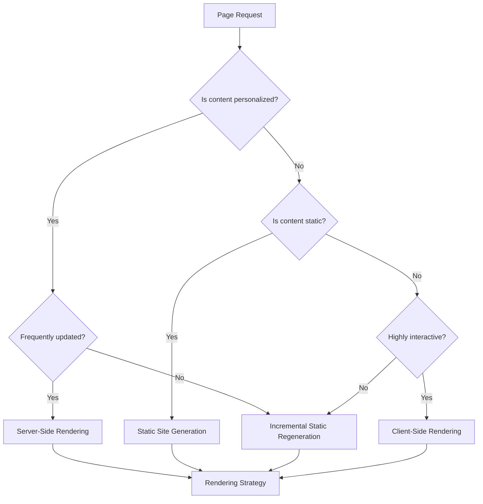

#### Decision Framework
- **Static Site Generation (SSG)**: For content that rarely changes (documentation, product pages)
- **Incremental Static Regeneration (ISR)**: For content that changes periodically (case studies, blog)
- **Server-Side Rendering (SSR)**: For personalized or frequently updated content
- **Client-Side Rendering (CSR)**: For highly interactive components after initial load
- **Hybrid Approach**: Combining strategies based on component needs within a page

## 5. Security Considerations

### 5.1 Authentication/Authorization Approach

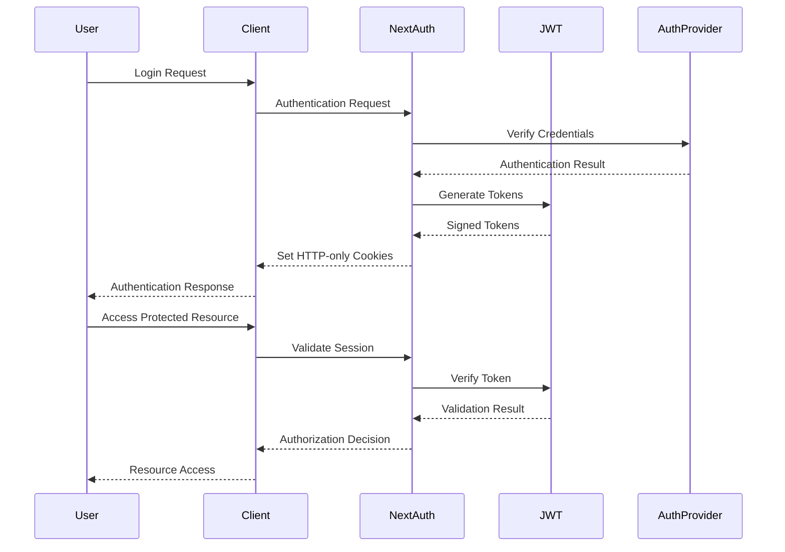

#### Authentication Features
- **Multi-provider Authentication**: Support for email/password, OAuth, and SSO
- **Role-Based Access Control**: For content management and administrative functions
- **JWT Authentication**: Secure, stateless authentication with appropriate expiration
- **Session Management**: Secure session handling with refresh token rotation

### 5.2 Data Protection Measures

The architecture implements multiple layers of data protection:

- **Data Encryption**: TLS for data in transit, encryption for sensitive data at rest
- **Input Validation**: Comprehensive server-side validation of all user inputs
- **Output Encoding**: Context-appropriate encoding to prevent XSS attacks
- **Content Security Policy**: Strict CSP to mitigate XSS and data injection attacks
- **CORS Configuration**: Appropriate cross-origin resource sharing policies
- **Privacy Controls**: Compliance with GDPR, CCPA, and other privacy regulations
- **Data Minimization**: Collection and storage of only necessary user data

### 5.3 API Security Patterns

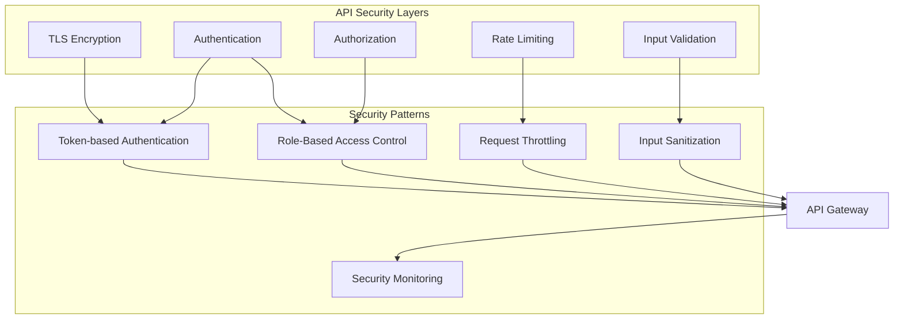

#### Implementation Details
- **API Gateway**: Centralized entry point for API security enforcement
- **Token-based Authentication**: JWT with appropriate signature algorithm and expiration
- **Rate Limiting**: Per-user and per-IP rate limiting to prevent abuse
- **Request Validation**: Schema-based validation of all API requests
- **Sensitive Data Handling**: Appropriate masking and protection of sensitive data
- **Security Headers**: Implementation of security headers (HSTS, X-Content-Type-Options, etc.)

## 6. Scalability Design

### 6.1 Content Scaling Approach

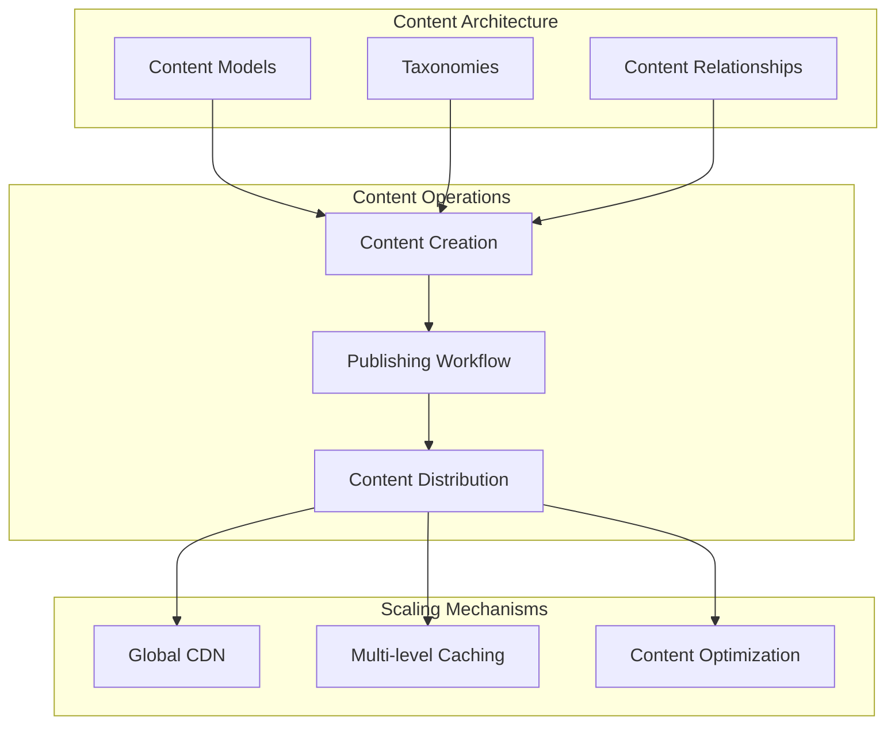

#### Scalability Features
- **Structured Content Modeling**: Flexible content types that can evolve over time
- **Content Reusability**: Component-based content for consistent reuse across the site
- **Automated Workflows**: Streamlined content creation and approval processes
- **Content Federation**: Ability to integrate content from multiple sources
- **Global Distribution**: CDN-based content delivery for worldwide performance

### 6.2 User Growth Considerations

The architecture is designed to accommodate growing user numbers through:

- **Stateless Architecture**: Enabling horizontal scaling of application servers
- **Database Scaling**: Preparation for read replicas and sharding as needed
- **Microservices Preparation**: Architecture that can evolve toward microservices
- **Caching Layers**: Multi-level caching to reduce database and API load
- **Asynchronous Processing**: Queue-based processing for non-critical operations
- **Infrastructure as Code**: Automated scaling based on demand patterns

### 6.3 Performance Under Load

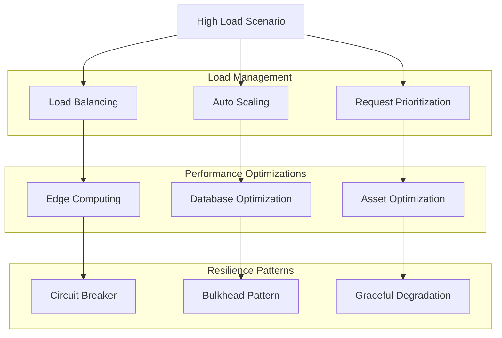

#### Implementation Strategies
- **Edge Computing**: Moving computation closer to users with edge functions
- **Adaptive Loading**: Serving simplified content under high load conditions
- **Resource Prioritization**: Critical path optimization for essential functionality
- **Graceful Degradation**: Fallback strategies for non-essential features
- **Monitoring and Alerting**: Real-time performance monitoring with automated scaling

## 7. Implementation Guidelines

### 7.1 Coding Standards and Patterns

The implementation will follow these coding standards and patterns:

#### Code Organization
- **Feature-Based Structure**: Organizing code by feature rather than type
- **Atomic Design Methodology**: Building UI from atoms to organisms to templates
- **Clean Architecture**: Separation of concerns with clear boundaries
- **SOLID Principles**: Following solid software engineering principles

#### Naming Conventions
- **Descriptive Naming**: Clear, intention-revealing names for all entities
- **Consistent Casing**: camelCase for variables/functions, PascalCase for components
- **Semantic Naming**: Names that reflect purpose rather than implementation

#### Design Patterns
- **Provider Pattern**: For context-based state sharing
- **Render Props/Hooks**: For component logic reuse
- **Container/Presentation**: Separation of data fetching and presentation
- **Adapter Pattern**: For external service integration

### 7.2 Component Structure

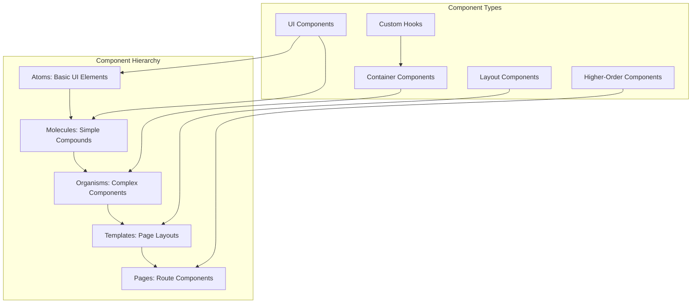

#### Component Guidelines
- **Single Responsibility**: Each component should do one thing well
- **Composability**: Components should be easily composable
- **Prop API Design**: Consistent, well-documented props with defaults
- **Accessibility**: Built-in accessibility features in all components
- **Testing**: Each component accompanied by appropriate tests

### 7.3 File Organization

The project will follow a structured file organization:

```
/app                     # Next.js App Router
  /(auth)                # Authentication routes
  /(default)             # Main site routes
  /api                   # API routes
/components              # Shared components
  /atoms                 # Basic UI elements
  /molecules             # Simple compound components
  /organisms             # Complex components
  /templates             # Page layouts
/lib                     # Shared utilities
  /api                   # API clients
  /hooks                 # Custom React hooks
  /utils                 # Helper functions
/public                  # Static assets
/styles                  # Global styles
/types                   # TypeScript type definitions
```

#### File Naming Conventions
- **Component Files**: PascalCase.tsx (e.g., Button.tsx)
- **Utility Files**: camelCase.ts (e.g., formatDate.ts)
- **Test Files**: ComponentName.test.tsx
- **Style Files**: ComponentName.module.css

### 7.4 Testing Approach

The testing strategy includes multiple testing types:

- **Unit Testing**: For individual functions and components
- **Integration Testing**: For component interactions and API integrations
- **E2E Testing**: For critical user flows and journeys
- **Visual Regression Testing**: For UI component consistency
- **Accessibility Testing**: For WCAG compliance
- **Performance Testing**: For load time and interaction responsiveness

#### Testing Tools
- **Jest**: For unit and integration testing
- **React Testing Library**: For component testing
- **Cypress**: For end-to-end testing
- **Lighthouse**: For performance and accessibility auditing
- **Storybook**: For component development and visual testing

## 8. Integration Points

### 8.1 Analytics Integration Architecture

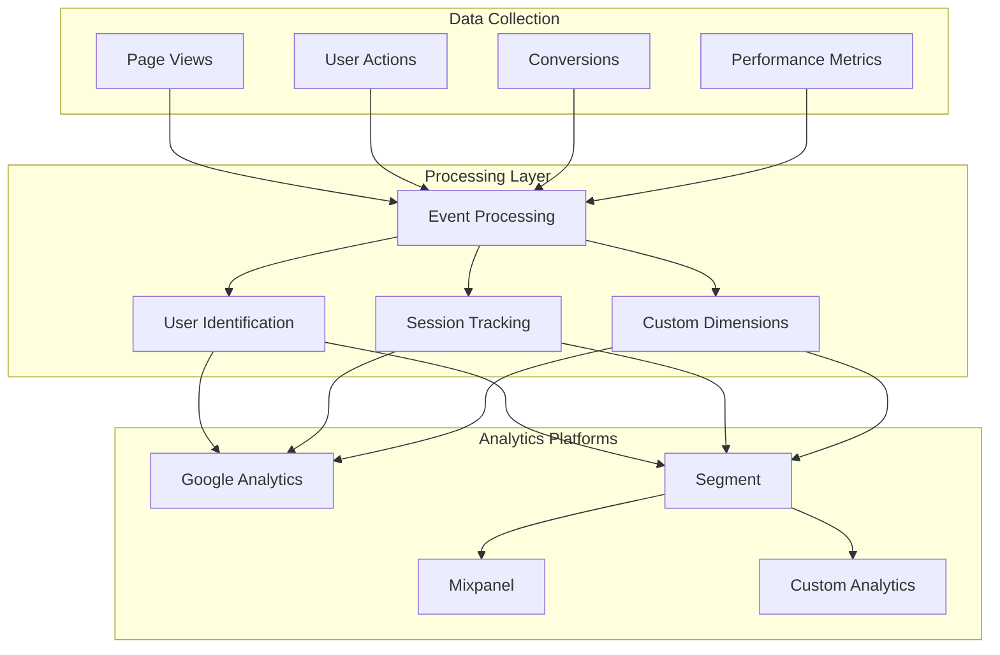

#### Implementation Details
- **Data Layer**: Standardized data layer for consistent event tracking
- **Consent Management**: GDPR/CCPA compliant user consent handling
- **Custom Dimensions**: Tracking of user segments and journey stages
- **Event Taxonomy**: Structured naming convention for all tracked events
- **Server-Side Tracking**: For improved accuracy and performance

### 8.2 Third-Party Service Connections

The architecture supports integration with various third-party services:

- **Authentication Providers**: OAuth integration with major providers
- **Marketing Automation**: Integration with email and marketing platforms
- **Customer Support**: Helpdesk and chat widget integration
- **Social Media**: Sharing and embedding capabilities
- **Developer Tools**: GitHub, documentation tools integration

#### Integration Patterns
- **API-First Integration**: Preference for API-based integration over widgets
- **Lazy Loading**: Third-party scripts loaded only when needed
- **Fallback Mechanisms**: Graceful handling of service unavailability
- **Data Privacy**: Careful management of data shared with third parties

### 8.3 API Consumption Patterns

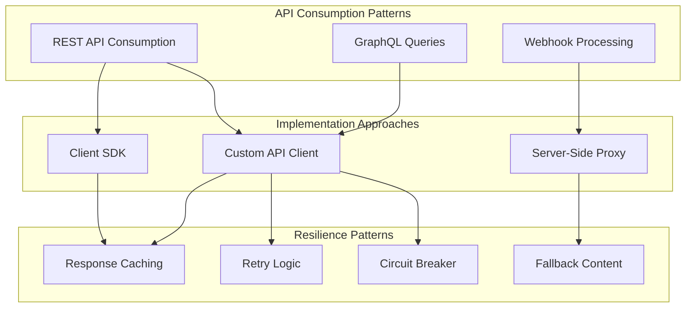

#### API Consumption Strategies
- **Centralized API Layer**: Unified API client with consistent error handling
- **Request Batching**: Combining multiple requests where appropriate
- **Optimistic Updates**: Immediate UI updates with background synchronization
- **Offline Support**: Queueing requests when offline with background sync
- **Type Safety**: Strongly typed API responses with TypeScript

## 9. Alignment with Key Differentiators

### 9.1 Model Portability

The architecture supports the Model Portability differentiator through:

- **Adapter Pattern**: Abstraction layer for different LLM providers
- **Provider Switching UI**: Interface for selecting and configuring providers
- **Comparison Visualizations**: Side-by-side output comparison from different models
- **Performance Metrics**: Tracking and visualization of model performance differences
- **Migration Guides**: Documentation for transitioning between providers

### 9.2 Orchestration Excellence

The architecture demonstrates Orchestration Excellence through:

- **Workflow Visualization**: Interactive diagrams of agent orchestration patterns
- **Component Architecture**: Modular design reflecting orchestration capabilities
- **Live Demos**: Interactive demonstrations of multi-agent workflows
- **Case Study Presentation**: Visual storytelling of complex orchestration scenarios
- **Documentation Structure**: Clear organization of orchestration patterns and APIs

### 9.3 Memory Persistence

The architecture supports the Memory Persistence differentiator through:

- **Memory Visualization**: Interactive displays of memory management capabilities
- **State Flow Diagrams**: Visual representation of context maintenance
- **Technical Documentation**: Detailed explanation of memory optimization techniques
- **Comparison Tools**: Side-by-side comparison with traditional approaches
- **Performance Metrics**: Visualization of memory efficiency gains

### 9.4 Operational Reliability

The architecture demonstrates Operational Reliability through:

- **Monitoring Visualization**: Dashboard representations of reliability features
- **Error Handling Patterns**: Consistent approach to resilience throughout the site
- **Uptime Metrics**: Real-time display of system reliability statistics
- **Case Study Focus**: Emphasis on reliability outcomes in case studies
- **Documentation Structure**: Prominent reliability patterns and best practices

## 10. Conclusion

This comprehensive architecture provides a solid foundation for implementing the IdeaCode website revamp. It addresses all the requirements specified in the project documentation while ensuring scalability, performance, and maintainability. The architecture is designed to effectively communicate IdeaCode's value proposition as an enterprise-grade orchestration layer for AI agent systems, with special emphasis on the four key differentiators.

The modular approach allows for phased implementation as outlined in the project specifications, with each phase building upon the previous one. The architecture supports both technical and business-focused content tracks, providing appropriate experiences for different audience segments.

By following this architecture, the implementation team will be able to create a website that not only meets the current requirements but is also prepared for future growth and evolution.