# R&D Agent Store Landing Page Architecture Diagrams

This document provides visual representations of the architecture for both landing page alternatives using Mermaid diagrams.

## Component Architecture Overview

The following diagram shows the high-level component architecture that applies to both landing page alternatives:

## Teaser Approach Component Architecture

The following diagram shows the detailed component architecture for the Teaser Approach:

## Technical Preview Approach Component Architecture

The following diagram shows the detailed component architecture for the Technical Preview Approach:

## Data Flow Diagram

The following diagram shows the data flow for both landing page alternatives:

## Responsive Behavior Diagram

The following diagram illustrates how components adapt across different viewport sizes:

```mermaid
graph TD
    subgraph "Viewport Sizes"
        Mobile[Mobile < 640px]
        Tablet[Tablet 640px - 1023px]
        Desktop[Desktop 1024px - 1279px]
        LargeDesktop[Large Desktop ≥ 1280px]
    end
    
    subgraph "Layout Adaptations"
        L1[Single Column]
        L2[Two Columns]
        L3[Three Columns]
        L4[Four Columns]
    end
    
    subgraph "Navigation Adaptations"
        N1[Hamburger Menu]
        N2[Horizontal Nav]
        N3[Expanded Nav]
    end
    
    subgraph "Content Adaptations"
        C1[Simplified Visuals]
        C2[Basic Interactivity]
        C3[Full Interactivity]
        C4[Enhanced Visuals]
    end
    
    Mobile --> L1
    Tablet --> L2
    Desktop --> L3
    LargeDesktop --> L4
    
    Mobile --> N1
    Tablet --> N2
    Desktop --> N2
    LargeDesktop --> N3
    
    Mobile --> C1
    Tablet --> C2
    Desktop --> C3
    LargeDesktop --> C4
```

## TDD Implementation Flow

The following diagram illustrates the Test-Driven Development flow for implementing both landing page alternatives:

## Hybrid Approach Architecture

The following diagram illustrates the recommended hybrid approach that combines elements from both alternatives:

These diagrams provide a visual representation of the component architecture, data flow, responsive behavior, and implementation approach for both landing page alternatives, as well as the recommended hybrid approach.