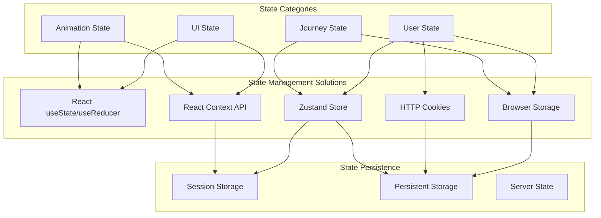
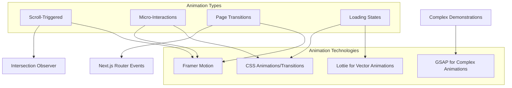
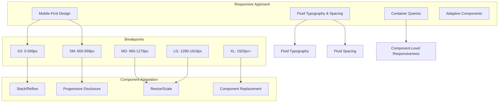
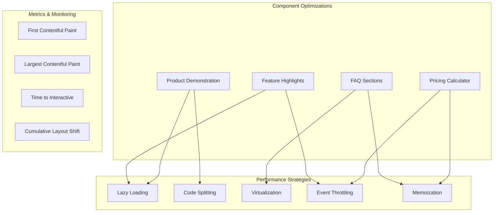
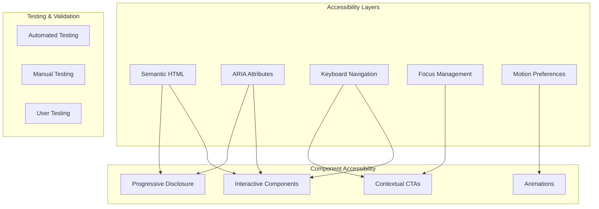
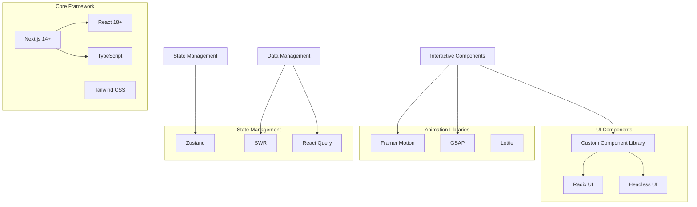
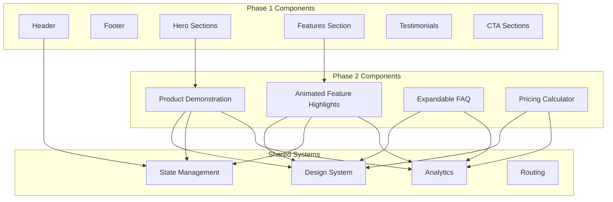
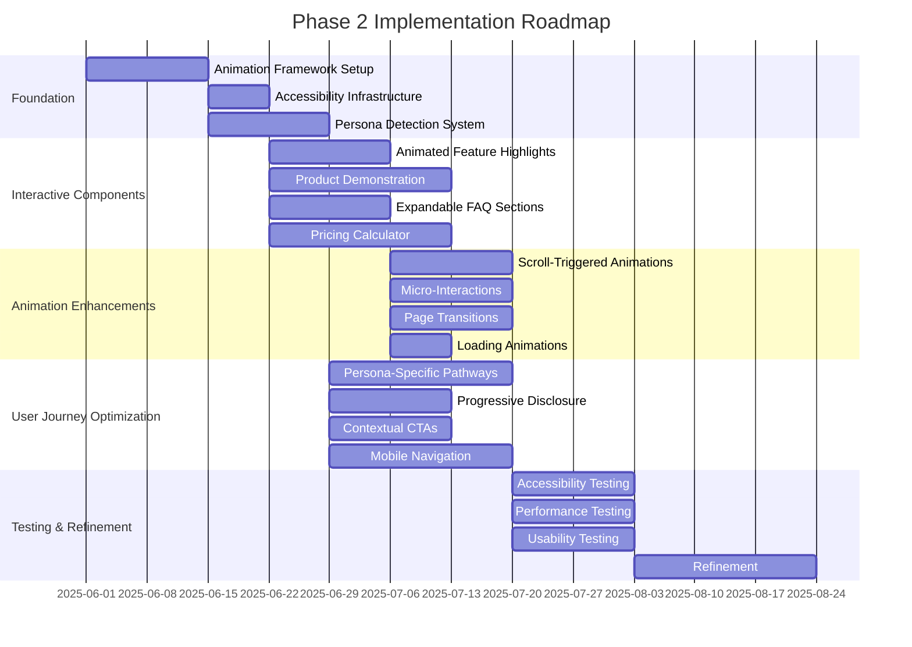

# IdeaCode Website Phase 2: Enhanced User Experience Architecture

## 1. Component Architecture

### 1.1 Component Hierarchy and Relationships

```mermaid
graph TD
    subgraph "Core Components"
        UI[UI Layer]
        UI --> AnimationSystem[Animation System]
        UI --> InteractiveComponents[Interactive Components]
        UI --> UserJourneySystem[User Journey System]
        UI --> ResponsiveSystem[Responsive System]
    end
    
    subgraph "Animation System"
        AnimationSystem --> ScrollAnimations[Scroll Animations]
        AnimationSystem --> MicroInteractions[Micro-Interactions]
        AnimationSystem --> PageTransitions[Page Transitions]
        AnimationSystem --> LoadingAnimations[Loading Animations]
        AnimationSystem --> ReducedMotion[Reduced Motion Handler]
    end
    
    subgraph "Interactive Components"
        InteractiveComponents --> FeatureHighlights[Animated Feature Highlights]
        InteractiveComponents --> ProductDemo[Product Demonstration]
        InteractiveComponents --> FAQSections[Expandable FAQ Sections]
        InteractiveComponents --> PricingCalculator[Pricing Calculator]
    end
    
    subgraph "User Journey System"
        UserJourneySystem --> PersonaDetection[Persona Detection]
        UserJourneySystem --> JourneyTracking[Journey Tracking]
        UserJourneySystem --> ProgressiveDisclosure[Progressive Disclosure]
        UserJourneySystem --> ContextualCTAs[Contextual CTAs]
    end
    
    subgraph "Responsive System"
        ResponsiveSystem --> BreakpointManager[Breakpoint Manager]
        ResponsiveSystem --> MobileNavigation[Mobile Navigation]
        ResponsiveSystem --> AdaptiveLayout[Adaptive Layout]
        ResponsiveSystem --> TouchOptimization[Touch Optimization]
    end
    
    subgraph "State Management"
        GlobalState[Global State]
        ComponentState[Component State]
        UserState[User State]
        AnimationState[Animation State]
    end
    
    UserJourneySystem --> GlobalState
    InteractiveComponents --> ComponentState
    AnimationSystem --> AnimationState
    PersonaDetection --> UserState
```



### 1.2 Component Responsibilities

#### 1.2.1 Animation System Components

| Component | Responsibility |
|-----------|----------------|
| **ScrollAnimations** | Manages intersection observer-based animations triggered by scroll position |
| **MicroInteractions** | Handles subtle animations for interactive elements providing visual feedback |
| **PageTransitions** | Controls smooth transitions between pages maintaining context |
| **LoadingAnimations** | Manages loading state animations for asynchronous operations |
| **ReducedMotion** | Ensures animations respect user preferences for reduced motion |

#### 1.2.2 Interactive Components

| Component | Responsibility |
|-----------|----------------|
| **FeatureHighlights** | Displays animated product features with expandable details |
| **ProductDemo** | Provides interactive demonstrations of product capabilities |
| **FAQSections** | Manages expandable/collapsible FAQ items with filtering and search |
| **PricingCalculator** | Calculates and compares pricing based on user inputs |

#### 1.2.3 User Journey System

| Component | Responsibility |
|-----------|----------------|
| **PersonaDetection** | Identifies user personas based on behavior and referral sources |
| **JourneyTracking** | Tracks user progress through defined journeys |
| **ProgressiveDisclosure** | Controls layered presentation of information based on user needs |
| **ContextualCTAs** | Manages context-aware call-to-action elements |

#### 1.2.4 Responsive System

| Component | Responsibility |
|-----------|----------------|
| **BreakpointManager** | Manages responsive breakpoints and viewport adaptations |
| **MobileNavigation** | Provides touch-optimized navigation for mobile devices |
| **AdaptiveLayout** | Controls layout changes across different screen sizes |
| **TouchOptimization** | Ensures appropriate touch targets and gesture support |

## 2. State Management Architecture

### 2.1 State Management Approach



### 2.2 State Management Implementation

#### 2.2.1 Component-Level State

- **Local Component State**: React's `useState` and `useReducer` for component-specific state
- **Compound Components**: State sharing between related components using React Context
- **Animation State**: Component-level state for animation controls and progress

#### 2.2.2 Global Application State

- **User Persona State**: Zustand store for managing detected and selected user personas
- **Journey State**: Zustand store for tracking user journey progress
- **Theme State**: React Context for theme preferences and reduced motion settings
- **Feature Flags**: Zustand store for managing feature availability

#### 2.2.3 Persistent State

- **User Preferences**: LocalStorage for persisting user preferences across sessions
- **Persona Selection**: Cookies for maintaining persona selection
- **Journey Progress**: LocalStorage for saving journey progress
- **Form Data**: SessionStorage for preserving form inputs during navigation

### 2.3 State Synchronization

- **Optimistic Updates**: Immediate UI updates with background synchronization
- **Revalidation**: SWR pattern for data fetching and revalidation
- **State Hydration**: Server-side state hydration for initial page load
- **State Persistence**: Automatic persistence of critical state across sessions

## 3. Animation Framework Architecture

### 3.1 Animation Technology Selection

The animation architecture will be built on Framer Motion as the primary animation library, with supplementary use of CSS animations for performance-critical micro-interactions.



### 3.2 Animation Implementation Strategy

#### 3.2.1 Scroll-Triggered Animations

- **Implementation**: Custom hook using Intersection Observer API with Framer Motion
- **Performance Optimization**: Throttling and debouncing of scroll events
- **Staggered Animations**: Coordinated animations for groups of elements
- **Lazy Initialization**: Animation setup only when components are near viewport

```typescript
// Pseudocode for useScrollAnimation hook
function useScrollAnimation(options) {
  const [isVisible, setIsVisible] = useState(false);
  const ref = useRef(null);
  
  useEffect(() => {
    const observer = new IntersectionObserver(
      ([entry]) => {
        if (entry.isIntersecting) {
          setIsVisible(true);
          if (options.once && ref.current) {
            observer.unobserve(ref.current);
          }
        } else if (!options.once) {
          setIsVisible(false);
        }
      },
      { threshold: options.threshold || 0.1 }
    );
    
    if (ref.current) {
      observer.observe(ref.current);
    }
    
    return () => {
      if (ref.current) {
        observer.unobserve(ref.current);
      }
    };
  }, [options.once, options.threshold]);
  
  return [ref, isVisible];
}
```

#### 3.2.2 Micro-Interactions

- **Implementation**: CSS transitions for simple state changes, Framer Motion for complex interactions
- **Performance Focus**: Hardware-accelerated properties (transform, opacity)
- **Interaction States**: Consistent animation for hover, focus, active, and pressed states
- **Feedback Timing**: Immediate visual feedback (50-150ms duration)

#### 3.2.3 Page Transitions

- **Implementation**: Next.js App Router with Framer Motion for page transitions
- **Shared Layouts**: Persistent layouts across page transitions
- **Context Preservation**: Maintaining scroll position and focus where appropriate
- **Progressive Enhancement**: Graceful fallback for browsers without JavaScript

#### 3.2.4 Loading State Animations

- **Implementation**: Combination of CSS animations and Lottie for complex animations
- **Progress Indicators**: Both determinate and indeterminate loading states
- **Skeleton Screens**: Content placeholders during loading
- **Optimistic UI**: Immediate feedback with background loading

### 3.3 Animation Orchestration

- **Animation Sequencing**: Coordinated timing of related animations
- **Animation Priorities**: Critical animations prioritized over decorative ones
- **Animation Throttling**: Limiting concurrent animations for performance
- **Reduced Motion**: Global system for respecting user preferences

## 4. Responsive Design Architecture

### 4.1 Responsive Strategy



### 4.2 Responsive Implementation

#### 4.2.1 Breakpoint System

- **Mobile-First Approach**: Base styles for mobile with progressive enhancement
- **Tailwind Integration**: Leveraging Tailwind's responsive utilities
- **Custom Media Queries**: Extended breakpoints for specific component needs
- **Container Queries**: Component-level responsiveness beyond viewport size

#### 4.2.2 Component Adaptation Patterns

- **Stack/Reflow Pattern**: Reorganizing horizontal layouts to vertical for smaller screens
- **Progressive Disclosure**: Revealing content progressively as screen size increases
- **Resize Pattern**: Proportionally scaling components based on available space
- **Component Replacement**: Substituting alternative components optimized for specific viewports

#### 4.2.3 Mobile Navigation Experience

- **Touch-Optimized Controls**: Larger touch targets (min 44×44px)
- **Gesture Support**: Swipe gestures for common actions
- **Streamlined Information Architecture**: Simplified navigation for mobile
- **Bottom Navigation**: Thumb-friendly navigation for mobile devices

## 5. Performance Optimization Strategy

### 5.1 Performance Considerations for Interactive Components



### 5.2 Performance Implementation

#### 5.2.1 Lazy Loading and Code Splitting

- **Component Lazy Loading**: Dynamic imports for interactive components
- **Route-Based Code Splitting**: Automatic code splitting by Next.js routes
- **Above-the-Fold Prioritization**: Critical content loaded first
- **Deferred Loading**: Non-critical components loaded after initial render

#### 5.2.2 Animation Performance

- **Hardware Acceleration**: Using transform and opacity for animations
- **Animation Throttling**: Limiting concurrent animations
- **Passive Event Listeners**: Optimized event handling
- **requestAnimationFrame**: Synchronized animations with browser rendering

#### 5.2.3 Data Management

- **Data Caching**: SWR for efficient data fetching and caching
- **Incremental Loading**: Loading data in chunks as needed
- **Optimistic Updates**: Immediate UI updates with background synchronization
- **Data Prefetching**: Preloading data for likely user paths

#### 5.2.4 Asset Optimization

- **Image Optimization**: Next.js Image component with WebP/AVIF support
- **Font Optimization**: Variable fonts with subsetting
- **SVG Optimization**: Optimized SVGs for icons and illustrations
- **Bundle Size Monitoring**: Tracking and limiting JavaScript bundle size

## 6. Accessibility Implementation

### 6.1 Accessibility Architecture



### 6.2 Accessibility Implementation

#### 6.2.1 Interactive Components Accessibility

- **Semantic Structure**: Proper HTML elements for interactive components
- **ARIA Attributes**: Appropriate ARIA roles, states, and properties
- **Keyboard Navigation**: Full keyboard support for all interactions
- **Focus Management**: Logical focus order and visible focus indicators
- **Screen Reader Announcements**: Appropriate announcements for dynamic content

#### 6.2.2 Animation Accessibility

- **Reduced Motion**: Respecting prefers-reduced-motion media query
- **Animation Timing**: Appropriate animation durations and delays
- **Animation Pausing**: Ability to pause animations
- **Alternative Content**: Non-animated alternatives where appropriate

#### 6.2.3 Progressive Disclosure Accessibility

- **Semantic Disclosure**: Using appropriate disclosure patterns
- **State Announcements**: Screen reader announcements for expanded/collapsed states
- **Keyboard Triggers**: Keyboard support for expanding/collapsing content
- **Content Relationships**: Clear relationships between triggers and content

#### 6.2.4 Mobile Accessibility

- **Touch Target Size**: Appropriate touch target sizes (min 44×44px)
- **Gesture Alternatives**: Alternative methods for gesture-based interactions
- **Orientation Support**: Support for both portrait and landscape orientations
- **Zoom Support**: Proper functioning at up to 200% zoom

## 7. Technical Dependencies and Libraries

### 7.1 Core Dependencies



### 7.2 Library Selection and Implementation

#### 7.2.1 Animation Libraries

- **Framer Motion**: Primary animation library for most components
- **GSAP**: For complex, timeline-based animations in product demonstrations
- **Lottie**: For vector animations in loading states and illustrations
- **CSS Animations**: For performance-critical micro-interactions

#### 7.2.2 State Management

- **Zustand**: Lightweight global state management
- **SWR/React Query**: Data fetching, caching, and state management
- **React Context**: For theme and localized component state
- **localStorage/sessionStorage**: For persistent state

#### 7.2.3 UI Component Libraries

- **Radix UI**: Accessible primitives for complex interactive components
- **Headless UI**: Additional unstyled, accessible components
- **Custom Component Library**: Built on top of primitives with design system

#### 7.2.4 Utility Libraries

- **date-fns**: Date manipulation and formatting
- **zod**: Runtime type validation for form inputs
- **react-hook-form**: Form state management and validation
- **next-intl**: Internationalization support

## 8. Integration with Existing Components

### 8.1 Integration Architecture



### 8.2 Integration Strategy

#### 8.2.1 Design System Integration

- **Consistent Visual Language**: Extending existing design tokens
- **Component Evolution**: Enhancing existing components with new capabilities
- **Shared Primitives**: Building on the same foundational components
- **Style Inheritance**: Maintaining visual consistency across phases

#### 8.2.2 State Management Integration

- **Unified State Structure**: Consistent state management approach
- **State Sharing**: Appropriate sharing of state between components
- **Event System**: Coordinated event handling across components
- **Context Providers**: Shared context providers for theme, user data, etc.

#### 8.2.3 Data Flow Integration

- **API Integration**: Consistent data fetching patterns
- **Data Sharing**: Efficient sharing of common data
- **Caching Strategy**: Unified caching approach
- **Error Handling**: Consistent error handling across components

#### 8.2.4 Analytics Integration

- **Event Tracking**: Consistent event tracking across components
- **User Journey Analytics**: Integrated journey tracking
- **Performance Monitoring**: Unified performance monitoring
- **A/B Testing**: Integrated experimentation framework

## 9. Implementation Roadmap

### 9.1 Phased Implementation Approach



### 9.2 Implementation Priorities

1. **Foundation Phase**:
   - Animation framework setup
   - Accessibility infrastructure
   - Persona detection system

2. **Interactive Components Phase**:
   - Animated feature highlights
   - Product demonstration
   - Expandable FAQ sections
   - Pricing calculator

3. **Animation Enhancements Phase**:
   - Scroll-triggered animations
   - Micro-interactions
   - Page transitions
   - Loading animations

4. **User Journey Optimization Phase**:
   - Persona-specific pathways
   - Progressive disclosure
   - Contextual CTAs
   - Mobile navigation enhancements

5. **Testing and Refinement Phase**:
   - Accessibility testing
   - Performance testing
   - Usability testing
   - Refinement based on test results

## 10. Conclusion

The Phase 2 architecture builds upon the solid foundation established in Phase 1, introducing enhanced user experience components through interactive elements, animations, and personalized user journeys. The architecture prioritizes:

1. **Component Modularity**: Well-defined, reusable components with clear responsibilities
2. **Performance Optimization**: Efficient animations and interactions that don't compromise speed
3. **Accessibility**: Full compliance with WCAG 2.1 AA standards across all new components
4. **Responsive Design**: Fluid adaptation across all device sizes with mobile-first approach
5. **Progressive Enhancement**: Core functionality without JavaScript, enhanced with it
6. **Maintainability**: Clear patterns and documentation for future development

This architecture provides a comprehensive blueprint for implementing the Phase 2 enhancements while ensuring they integrate seamlessly with the existing website components and maintain high standards for performance, accessibility, and user experience.