# IdeaCode Website Phase 2: Data Flow Architecture

This document outlines the data flow architecture for Phase 2 of the IdeaCode website, focusing on how data moves through the enhanced user experience components.

## 1. High-Level Data Flow

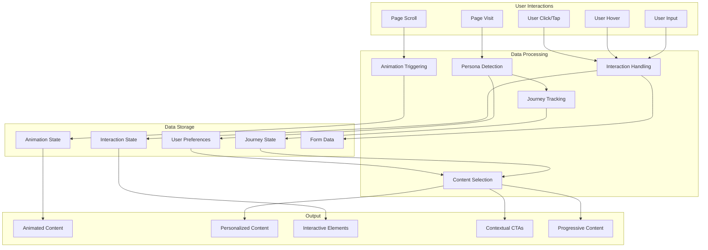

## 2. Persona Detection and User Journey Flow

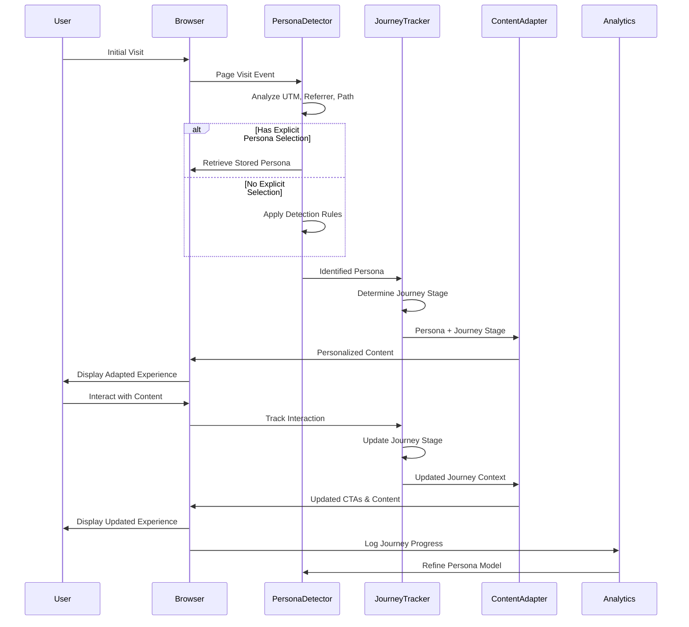

## 3. Interactive Components Data Flow

### 3.1 Animated Feature Highlights

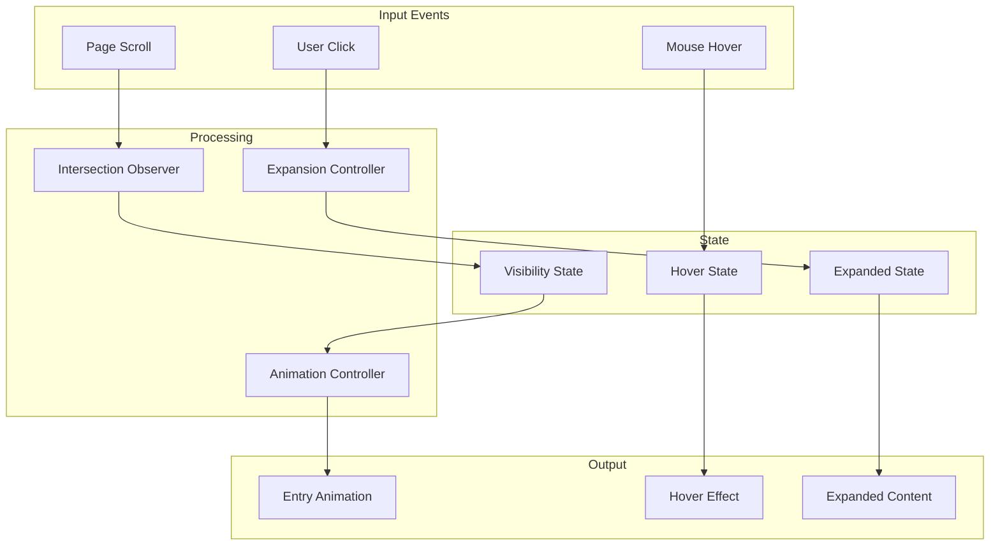

### 3.2 Interactive Product Demonstration

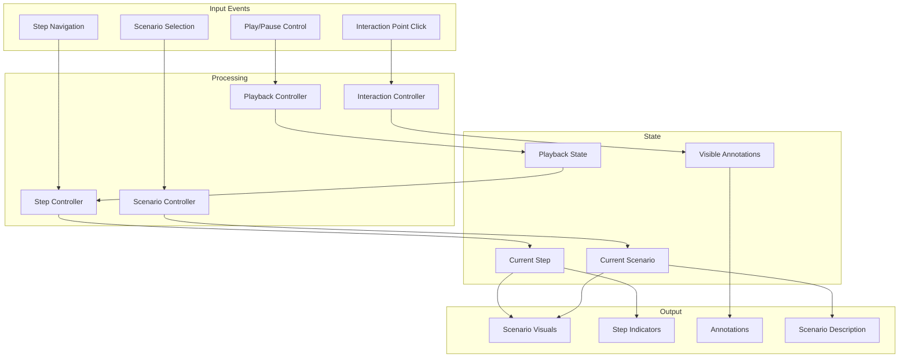

### 3.3 Expandable FAQ Sections

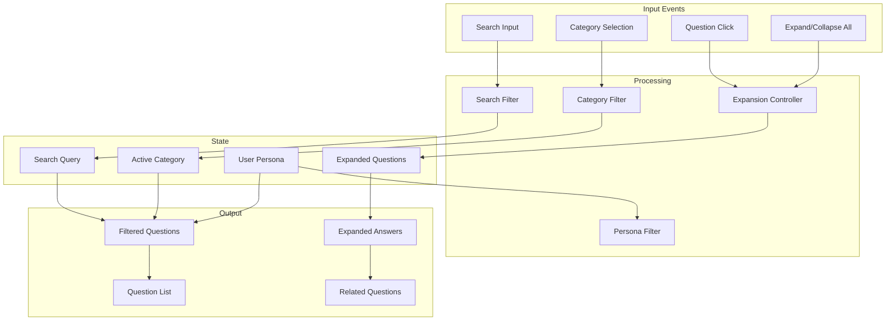

### 3.4 Interactive Pricing Calculator

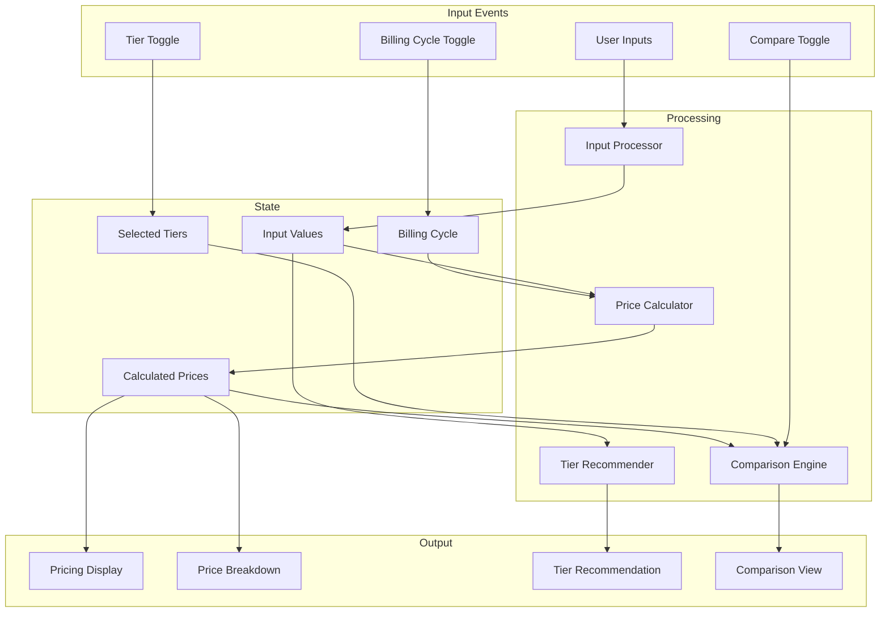

## 4. Animation System Data Flow

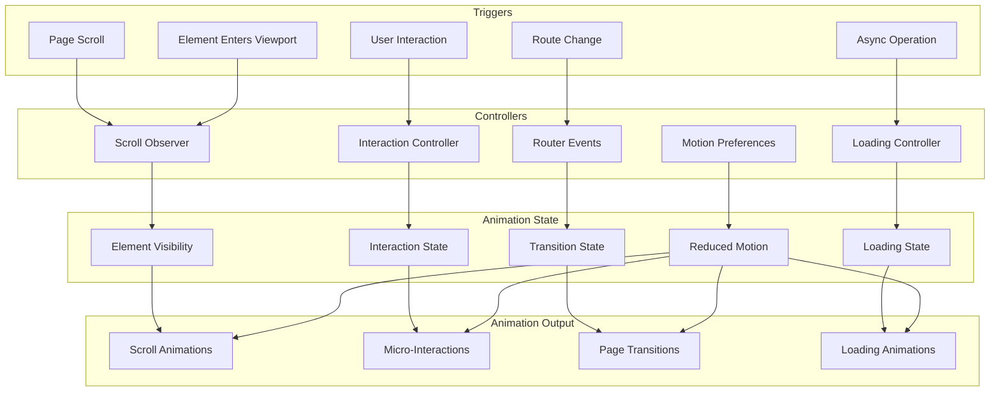

## 5. Progressive Disclosure Data Flow

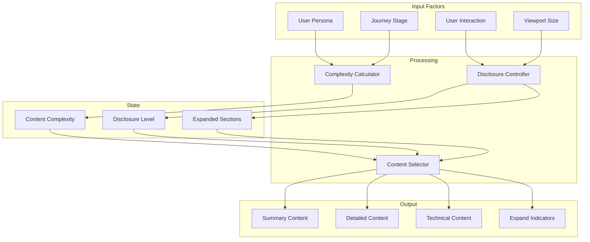

## 6. Contextual CTA Data Flow

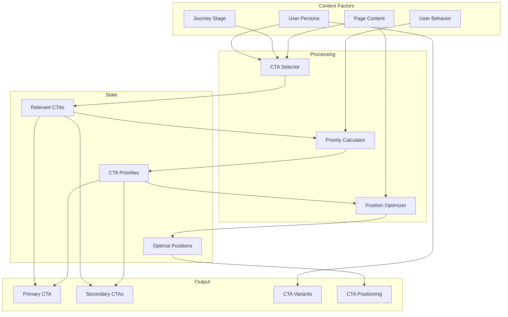

## 7. Integration with Existing Systems

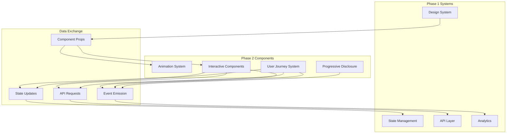

## 8. Mobile-Specific Data Flow

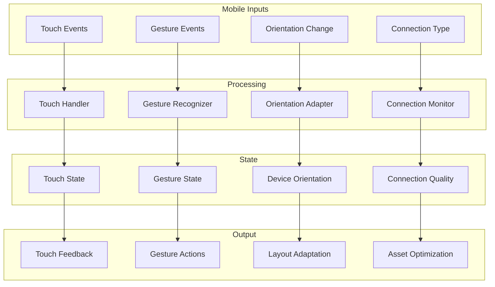

## 9. Performance Monitoring Data Flow

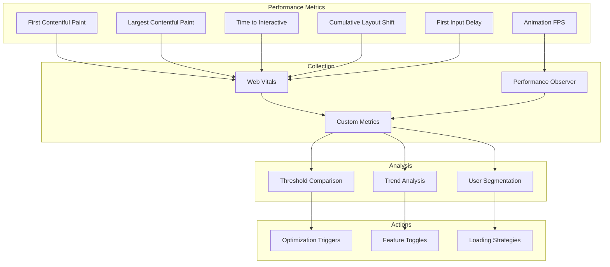

## 10. Accessibility Data Flow

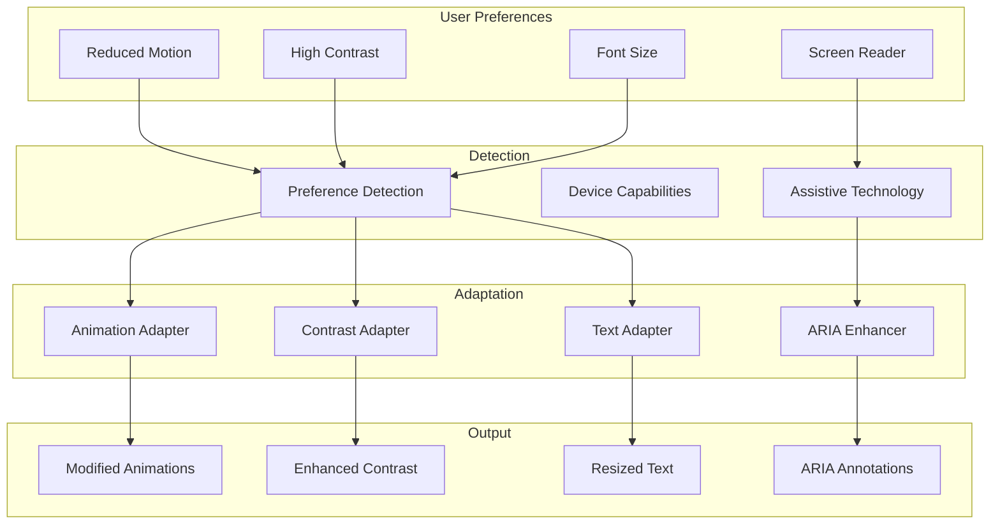

This comprehensive data flow architecture illustrates how data moves through the Phase 2 components, from user interactions to visual output, while integrating with existing systems and accounting for performance, accessibility, and mobile considerations.