# IdeaCode Website Responsive Design Architecture

## 1. Responsive Design Philosophy

The IdeaCode website responsive design architecture follows a **mobile-first, content-centric** approach that prioritizes:

1. **Content Accessibility**: Ensuring all content is accessible across all devices
2. **Performance Optimization**: Prioritizing fast load times on mobile networks
3. **Progressive Enhancement**: Building the core experience for mobile, then enhancing for larger screens
4. **Contextual Adaptation**: Adapting not just layouts but content presentation based on device context
5. **Consistent Brand Experience**: Maintaining brand identity across all breakpoints

## 2. Breakpoint Strategy

### 2.1 Core Breakpoints

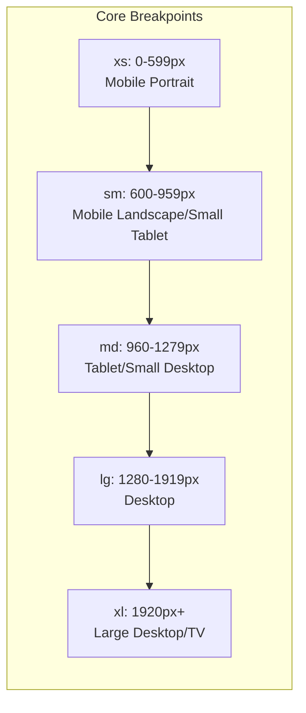

### 2.2 Implementation Approach

The breakpoint implementation uses a combination of:

```scss
// Breakpoint mixins
@mixin xs-only {
  @media (max-width: 599px) { @content; }
}

@mixin sm-and-up {
  @media (min-width: 600px) { @content; }
}

@mixin sm-only {
  @media (min-width: 600px) and (max-width: 959px) { @content; }
}

@mixin md-and-up {
  @media (min-width: 960px) { @content; }
}

@mixin md-only {
  @media (min-width: 960px) and (max-width: 1279px) { @content; }
}

@mixin lg-and-up {
  @media (min-width: 1280px) { @content; }
}

@mixin lg-only {
  @media (min-width: 1280px) and (max-width: 1919px) { @content; }
}

@mixin xl-and-up {
  @media (min-width: 1920px) { @content; }
}
```

### 2.3 Tailwind CSS Configuration

```javascript
// tailwind.config.js
module.exports = {
  theme: {
    screens: {
      'xs': '0px',
      'sm': '600px',
      'md': '960px',
      'lg': '1280px',
      'xl': '1920px',
    },
    // Other theme configuration
  },
  // Plugin configuration
}
```

### 2.4 Container Queries

For component-level responsiveness beyond viewport breakpoints:

```css
.component {
  container-type: inline-size;
  container-name: component;
}

@container component (min-width: 400px) {
  .component__element {
    /* Styles for component when container is at least 400px wide */
  }
}
```

## 3. Responsive Typography System

### 3.1 Fluid Typography Scale

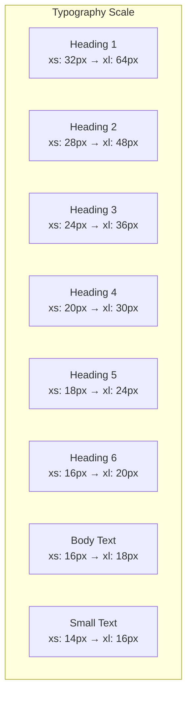

### 3.2 Implementation with CSS Clamp

```css
:root {
  --h1-font-size: clamp(2rem, 5vw + 1rem, 4rem);
  --h2-font-size: clamp(1.75rem, 4vw + 0.75rem, 3rem);
  --h3-font-size: clamp(1.5rem, 3vw + 0.5rem, 2.25rem);
  --h4-font-size: clamp(1.25rem, 2vw + 0.5rem, 1.875rem);
  --h5-font-size: clamp(1.125rem, 1vw + 0.5rem, 1.5rem);
  --h6-font-size: clamp(1rem, 0.5vw + 0.5rem, 1.25rem);
  --body-font-size: clamp(1rem, 0.5vw + 0.5rem, 1.125rem);
  --small-font-size: clamp(0.875rem, 0.25vw + 0.5rem, 1rem);
}

h1 { font-size: var(--h1-font-size); }
h2 { font-size: var(--h2-font-size); }
/* ... and so on */
```

### 3.3 Line Height Adjustments

```css
:root {
  --line-height-tight: 1.1;
  --line-height-normal: 1.5;
  --line-height-loose: 1.8;
}

@media (max-width: 599px) {
  h1, h2 { line-height: var(--line-height-tight); }
  p { line-height: var(--line-height-loose); }
}

@media (min-width: 600px) {
  h1, h2 { line-height: var(--line-height-normal); }
  p { line-height: var(--line-height-normal); }
}
```

## 4. Component Adaptation Patterns

### 4.1 Stack/Reflow Pattern

Used for converting horizontal layouts to vertical on smaller screens.

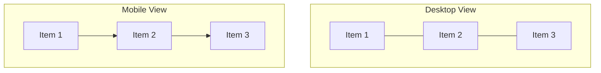

#### Implementation:

```jsx
// Flex-based implementation
<div className="flex flex-col md:flex-row gap-4">
  <div className="flex-1">Item 1</div>
  <div className="flex-1">Item 2</div>
  <div className="flex-1">Item 3</div>
</div>

// Grid-based implementation
<div className="grid grid-cols-1 md:grid-cols-3 gap-4">
  <div>Item 1</div>
  <div>Item 2</div>
  <div>Item 3</div>
</div>
```

### 4.2 Progressive Disclosure Pattern

Revealing content progressively as screen size increases.

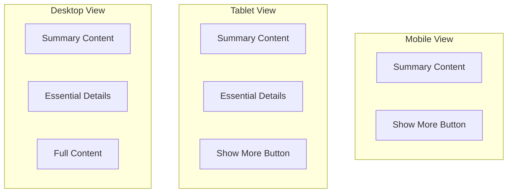

#### Implementation:

```jsx
const ProgressiveContent = () => {
  const [expanded, setExpanded] = useState(false);
  
  return (
    <div>
      <div className="summary-content">
        {/* Always visible content */}
      </div>
      
      <div className="essential-details hidden md:block">
        {/* Visible on md breakpoint and up */}
      </div>
      
      <div className={`full-content ${expanded ? 'block' : 'hidden'} lg:block`}>
        {/* Visible on lg breakpoint and up, or when expanded */}
      </div>
      
      <button 
        className="expand-button lg:hidden"
        onClick={() => setExpanded(!expanded)}
      >
        {expanded ? 'Show Less' : 'Show More'}
      </button>
    </div>
  );
};
```

### 4.3 Resize Pattern

Proportionally scaling components based on available space.

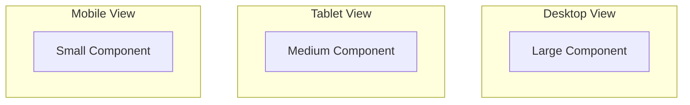

#### Implementation:

```jsx
// Size scaling with Tailwind
<div className="w-full max-w-xs sm:max-w-sm md:max-w-md lg:max-w-lg xl:max-w-xl mx-auto">
  
</div>

// Aspect ratio preservation
<div className="aspect-w-16 aspect-h-9">
  <iframe src="https://www.youtube.com/embed/..." className="w-full h-full"></iframe>
</div>
```

### 4.4 Transform Pattern

Changing component appearance while maintaining functionality.

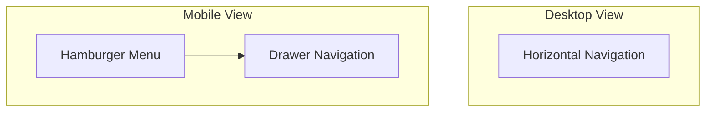

#### Implementation:

```jsx
const Navigation = () => {
  const [menuOpen, setMenuOpen] = useState(false);
  
  return (
    <nav>
      {/* Desktop Navigation */}
      <ul className="hidden md:flex space-x-4">
        <li><a href="/">Home</a></li>
        <li><a href="/features">Features</a></li>
        <li><a href="/docs">Documentation</a></li>
        <li><a href="/pricing">Pricing</a></li>
      </ul>
      
      {/* Mobile Navigation */}
      <button 
        className="md:hidden"
        onClick={() => setMenuOpen(!menuOpen)}
      >
        <span className="sr-only">Menu</span>
        <MenuIcon />
      </button>
      
      <div className={`md:hidden fixed inset-0 z-50 ${menuOpen ? 'block' : 'hidden'}`}>
        <div className="bg-white h-full w-4/5 max-w-sm shadow-lg">
          <ul className="py-4">
            <li><a href="/" className="block px-4 py-2">Home</a></li>
            <li><a href="/features" className="block px-4 py-2">Features</a></li>
            <li><a href="/docs" className="block px-4 py-2">Documentation</a></li>
            <li><a href="/pricing" className="block px-4 py-2">Pricing</a></li>
          </ul>
        </div>
      </div>
    </nav>
  );
};
```

### 4.5 Component Replacement Pattern

Substituting alternative components optimized for specific viewports.

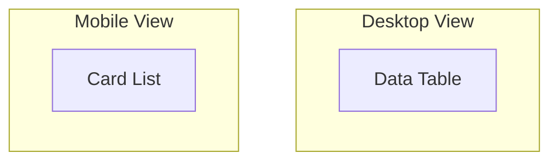

#### Implementation:

```jsx
const DataDisplay = ({ data }) => {
  return (
    <>
      {/* Desktop Table View */}
      <div className="hidden md:block">
        <table>
          <thead>
            <tr>
              <th>Name</th>
              <th>Category</th>
              <th>Status</th>
              <th>Actions</th>
            </tr>
          </thead>
          <tbody>
            {data.map(item => (
              <tr key={item.id}>
                <td>{item.name}</td>
                <td>{item.category}</td>
                <td>{item.status}</td>
                <td><button>View</button></td>
              </tr>
            ))}
          </tbody>
        </table>
      </div>
      
      {/* Mobile Card View */}
      <div className="md:hidden">
        <ul className="space-y-4">
          {data.map(item => (
            <li key={item.id} className="border rounded p-4">
              <h3>{item.name}</h3>
              <div>Category: {item.category}</div>
              <div>Status: {item.status}</div>
              <button className="mt-2">View</button>
            </li>
          ))}
        </ul>
      </div>
    </>
  );
};
```

## 5. Layout Adaptation Patterns

### 5.1 Homepage Layout Adaptation

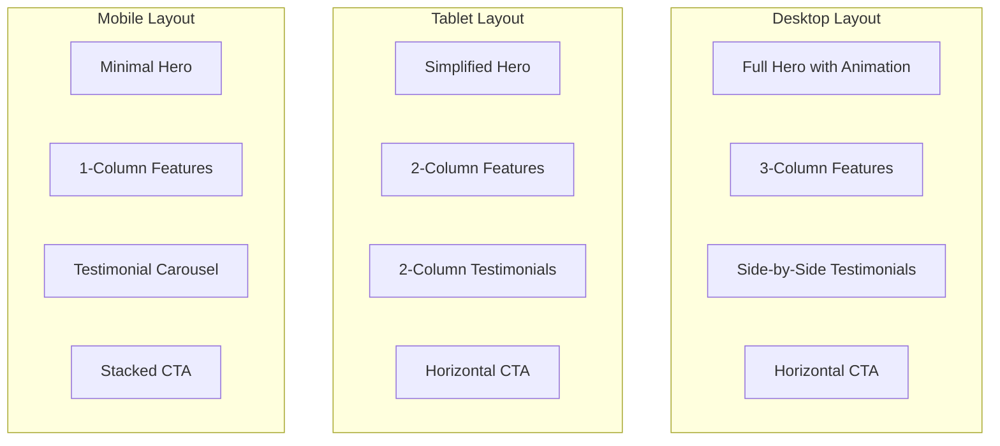

### 5.2 Documentation Page Layout Adaptation

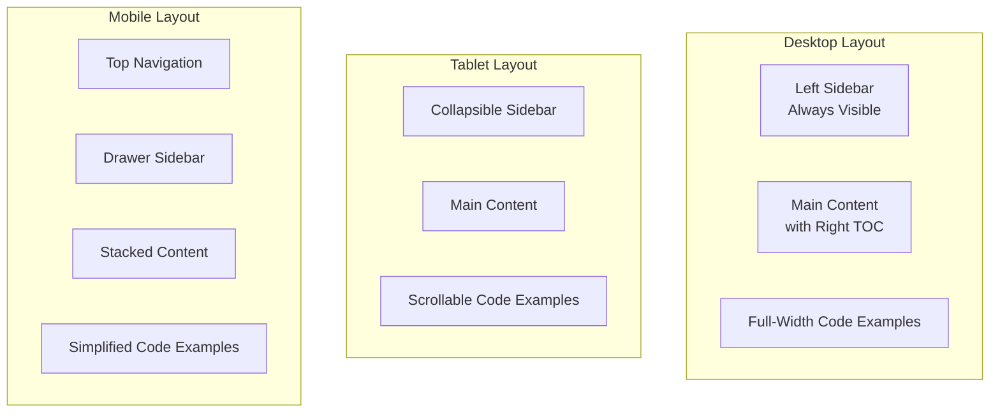

### 5.3 Product Feature Page Layout Adaptation

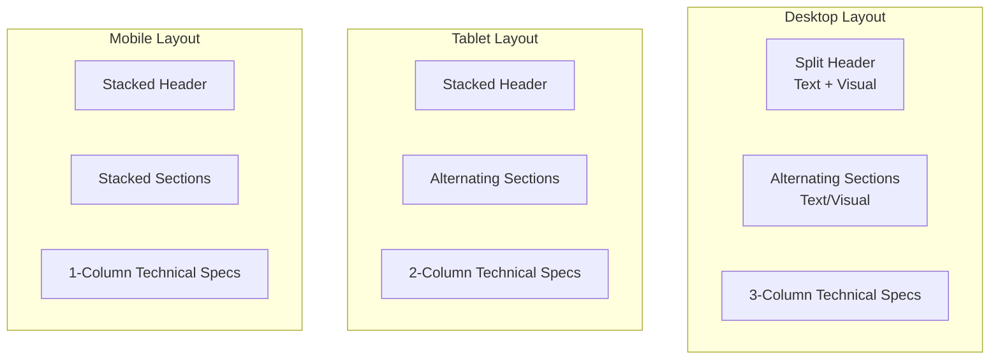

## 6. Mobile-First Considerations

### 6.1 Performance Optimization

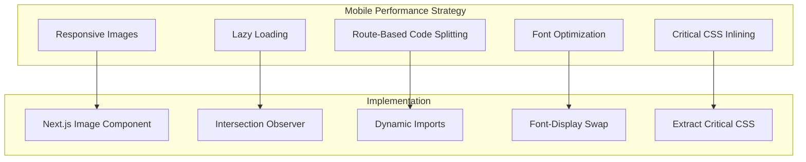

#### Key Performance Strategies:

1. **Image Optimization**:
   - Responsive images with appropriate sizes for each breakpoint
   - WebP/AVIF format with fallbacks
   - Lazy loading for below-the-fold images

2. **JavaScript Optimization**:
   - Route-based code splitting
   - Component-level code splitting for large components
   - Deferred loading of non-critical scripts

3. **CSS Optimization**:
   - Critical CSS inlining
   - Minimal CSS framework with tree-shaking
   - Efficient responsive design patterns

4. **Font Optimization**:
   - Subset fonts to include only necessary characters
   - Font-display: swap for text visibility during font loading
   - Variable fonts where appropriate

### 6.2 Touch Optimization

```css
/* Ensure touch targets are at least 44×44px */
.touch-target {
  min-height: 44px;
  min-width: 44px;
}

/* Add appropriate spacing between touch targets */
.touch-target-group {
  display: flex;
  gap: 8px;
}

/* Implement active states for touch feedback */
.touch-target:active {
  transform: scale(0.98);
  opacity: 0.8;
}
```

### 6.3 Viewport Configuration

```html
<meta name="viewport" content="width=device-width, initial-scale=1.0, viewport-fit=cover">
```

### 6.4 Reduced Motion Support

```css
/* Base animations */
.animated-element {
  transition: transform 0.3s ease-in-out;
}

/* Respect user preferences for reduced motion */
@media (prefers-reduced-motion: reduce) {
  .animated-element {
    transition: none;
  }
}
```

## 7. Responsive Testing Strategy

### 7.1 Device Testing Matrix

| Device Category | Screen Sizes | Devices |
|-----------------|--------------|---------|
| Mobile Small | 320-375px | iPhone SE, Galaxy S8 |
| Mobile Medium | 376-414px | iPhone 13, Pixel 5 |
| Mobile Large | 415-599px | iPhone 13 Pro Max, Galaxy S21 Ultra |
| Tablet Small | 600-768px | iPad Mini, Galaxy Tab A |
| Tablet Medium | 769-1024px | iPad Air, Surface Go |
| Tablet Large | 1025-1279px | iPad Pro, Surface Pro |
| Desktop Small | 1280-1440px | 13" Laptop, Small External Monitor |
| Desktop Medium | 1441-1919px | 15-16" Laptop, Standard Monitor |
| Desktop Large | 1920px+ | Large External Monitor, 4K Display |

### 7.2 Testing Tools and Approaches

1. **Automated Visual Testing**:
   - Storybook for component-level responsive testing
   - Percy for visual regression testing across breakpoints
   - Cypress for end-to-end testing on different viewport sizes

2. **Manual Testing Checklist**:
   - Text readability and line length
   - Touch target size and spacing
   - Content prioritization
   - Navigation usability
   - Form usability
   - Image quality and cropping
   - Performance metrics

3. **Accessibility Testing**:
   - Keyboard navigation testing
   - Screen reader testing
   - Color contrast at all breakpoints
   - Focus visibility across devices

## 8. Implementation Guidelines

### 8.1 Responsive Implementation Principles

1. **Mobile-First CSS**:
   - Start with mobile styles as the base
   - Use min-width media queries to enhance for larger screens
   - Avoid max-width queries except for specific overrides

2. **Fluid Values Over Fixed Breakpoints**:
   - Use relative units (%, em, rem) where possible
   - Implement fluid typography with clamp()
   - Create smooth transitions between breakpoints

3. **Proportional Spacing**:
   - Scale spacing based on viewport size
   - Maintain consistent spacing ratios
   - Use spacing scales tied to typography

4. **Content-Driven Breakpoints**:
   - Add breakpoints where content requires them
   - Consider content-specific breakpoints beyond standard ones
   - Use container queries for component-specific breakpoints

5. **Progressive Enhancement**:
   - Ensure core functionality works on all devices
   - Add enhanced features for larger screens
   - Gracefully degrade advanced features on older browsers

### 8.2 Component Development Workflow

1. Start with mobile design and implementation
2. Test on small screens first
3. Progressively enhance for larger breakpoints
4. Test each breakpoint during development
5. Implement specialized adaptations for edge cases
6. Document responsive behavior in component library

## 9. Responsive Design Governance

### 9.1 Design System Integration

The responsive design architecture is integrated with the design system through:

1. **Responsive Tokens**:
   - Breakpoint tokens
   - Responsive spacing scales
   - Responsive typography scales

2. **Component Documentation**:
   - Responsive behavior documentation
   - Breakpoint previews in Storybook
   - Responsive do's and don'ts

3. **Design-Development Handoff**:
   - Responsive design specifications
   - Breakpoint-specific annotations
   - Interactive prototypes at key breakpoints

### 9.2 Quality Assurance Process

1. **Component-Level Testing**:
   - Test each component at all breakpoints
   - Verify responsive behavior matches specifications
   - Check accessibility across breakpoints

2. **Page-Level Testing**:
   - Test complete pages at all breakpoints
   - Verify component interactions at different sizes
   - Check performance metrics across devices

3. **User Journey Testing**:
   - Test complete user journeys on different devices
   - Verify task completion across breakpoints
   - Measure performance impact on conversion

## 10. Conclusion

This responsive design architecture provides a comprehensive framework for implementing the IdeaCode website across all device types. By following a mobile-first approach with strategic progressive enhancement, the architecture ensures that all users receive an optimal experience regardless of their device.

The combination of fluid layouts, responsive typography, and adaptive components creates a seamless experience that maintains brand consistency while optimizing for each context. The performance optimizations ensure that mobile users receive fast-loading pages, while the touch optimizations make the site easy to use on touch devices.

By implementing this architecture, the IdeaCode website will effectively communicate its value proposition as an enterprise-grade orchestration layer for AI agent systems across all devices, reaching the full spectrum of its target audience regardless of how they access the site.