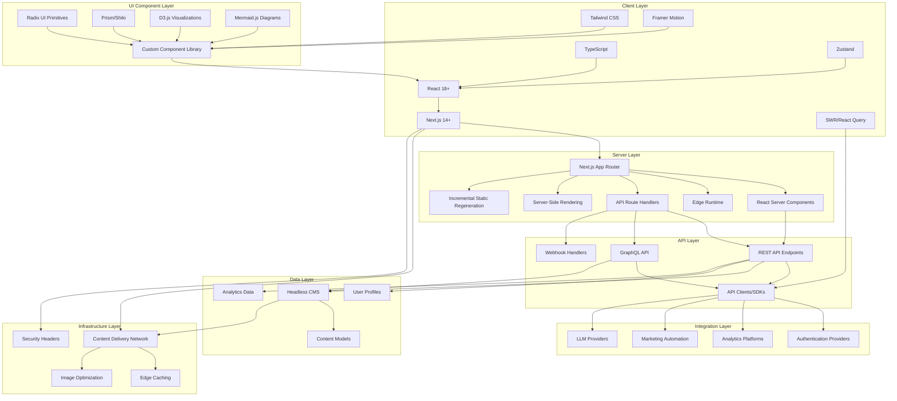

# IdeaCode Website Technical Stack

## Technology Stack Diagram

## Key Technology Choices

### Frontend Core
- **Next.js 14+**: Framework for server-rendered React applications
- **React 18+**: Component-based UI library with concurrent rendering
- **TypeScript**: Strongly-typed JavaScript for improved developer experience
- **Tailwind CSS**: Utility-first CSS framework for custom design system

### State Management & Data Fetching
- **SWR/React Query**: Data fetching, caching, and state synchronization
- **Zustand**: Lightweight global state management
- **React Context**: Component-level state sharing

### UI Components
- **Radix UI**: Accessible, unstyled UI primitives
- **Custom Component Library**: Branded, reusable components
- **Framer Motion**: Animation library for interactive elements
- **D3.js**: Data visualization for technical documentation
- **Mermaid.js**: Diagramming for technical architecture visualization

### Server-Side Technologies
- **Next.js App Router**: Modern routing system with nested layouts
- **React Server Components**: Server-rendered components for performance
- **Edge Runtime**: Global performance optimization
- **API Route Handlers**: Server-side API endpoints

### Content Management
- **Headless CMS**: Structured content management with API access
- **Content Models**: Typed content structures matching domain entities
- **Media Management**: Optimized digital asset handling

### Performance Optimization
- **CDN Integration**: Global content delivery
- **Image Optimization**: Automatic format selection and sizing
- **Code Splitting**: Route and component-based code splitting
- **Edge Caching**: Geographic distribution of cached content

### Security
- **Authentication**: JWT-based authentication with secure cookies
- **Authorization**: Role-based access control
- **Content Security Policy**: XSS protection
- **Security Headers**: HSTS, X-Content-Type-Options, etc.

### Analytics & Monitoring
- **Custom Event Tracking**: Structured event taxonomy
- **User Journey Analysis**: Path and conversion tracking
- **Performance Monitoring**: Real-time performance metrics
- **Error Tracking**: Client and server error monitoring

### Development Tooling
- **ESLint**: Code quality and consistency
- **Prettier**: Code formatting
- **Jest**: Unit and integration testing
- **React Testing Library**: Component testing
- **Cypress**: End-to-end testing
- **Storybook**: Component development and documentation

## Technology Selection Rationale

### Next.js Selection
Next.js was selected as the core framework due to:
- Alignment with existing technical constraints
- Strong support for both static and dynamic content
- Built-in performance optimization features
- Mature ecosystem and community support
- Flexible rendering strategies (SSG, SSR, ISR)

### Headless CMS Approach
A headless CMS approach was chosen to:
- Separate content management from presentation
- Enable structured content modeling
- Support multiple content delivery channels
- Facilitate content reuse across the site
- Enable non-technical content updates

### TypeScript Implementation
TypeScript was selected to:
- Improve code quality and maintainability
- Provide better developer experience with autocomplete
- Catch type-related errors during development
- Document component APIs and data structures
- Support larger team collaboration

### Tailwind CSS Selection
Tailwind CSS was chosen for styling because:
- It enables rapid UI development
- Provides consistent design tokens
- Results in smaller CSS bundle sizes
- Supports responsive design patterns
- Integrates well with component-based architecture

### Testing Strategy
The comprehensive testing approach includes:
- Unit tests for business logic and utilities
- Component tests for UI behavior
- Integration tests for feature workflows
- End-to-end tests for critical user journeys
- Accessibility tests for WCAG compliance
- Performance tests for load time optimization